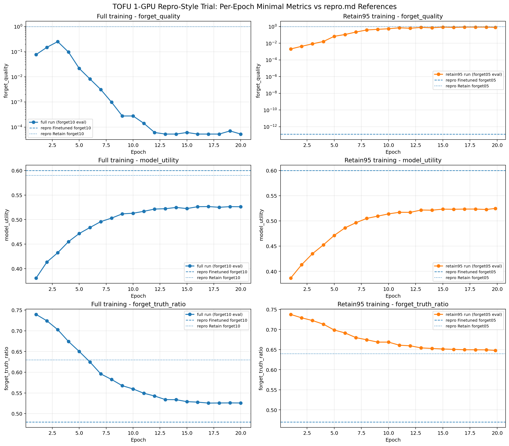
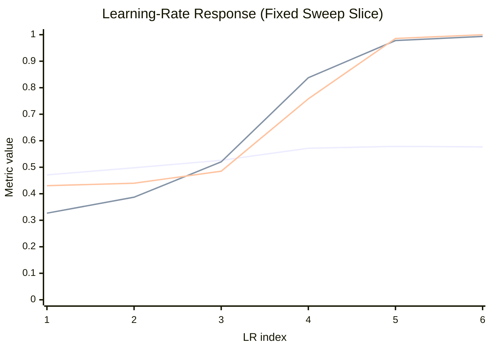
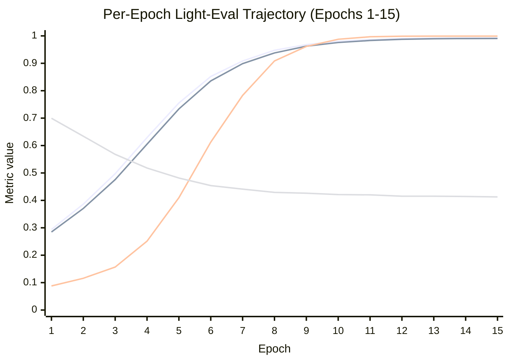
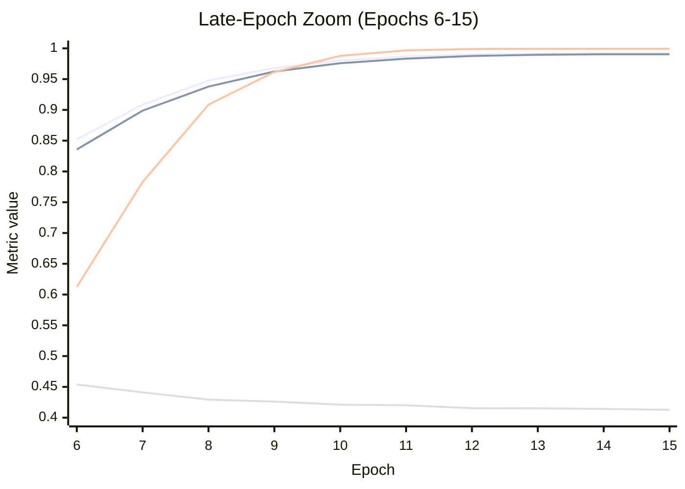
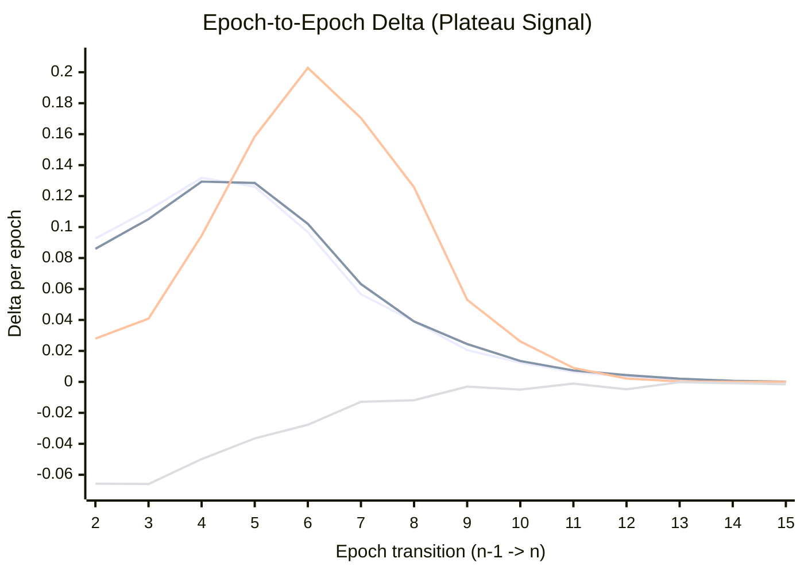
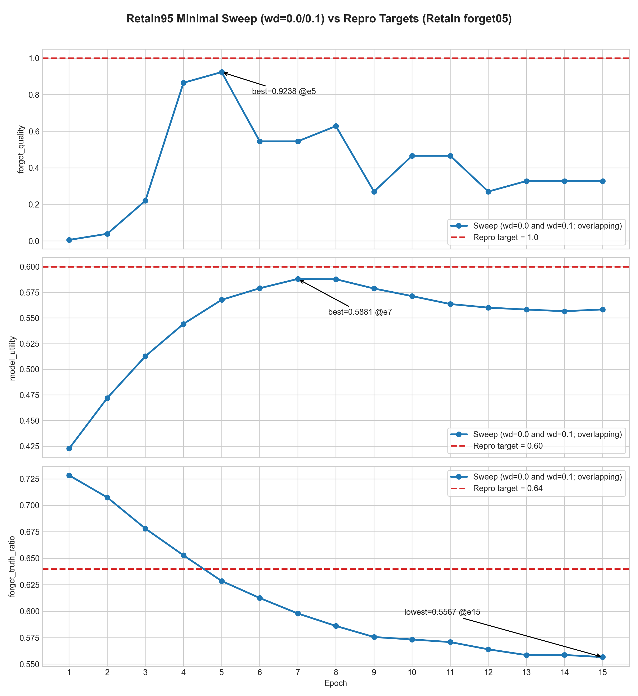

# TOFU Fine-Tuning Running Log

Last updated: 2026-05-26

This document is a comprehensive running log of experiments and metrics for Llama-3.2-1B TOFU fine-tuning calibration.

## 26 May 2026 - Dual 1-GPU Repro-Style Trial (Epoch Curves vs repro.md)

Scope:

- Runs: `tofu_Llama-3.2-1B-Instruct_full_repro1gpu_min_eval_e20_lr1e5_bs8_ga4` and `tofu_Llama-3.2-1B-Instruct_retain95_repro1gpu_min_eval_e20_lr1e5_bs8_ga4`
- Hardware: 1 x L40S each run
- Eval cadence: per-epoch minimal metrics only (`forget_quality`, `model_utility`, `forget_truth_ratio`)
- Reference source: `docs/repro.md` table for Llama-3.2-1B-Instruct (`Finetuned` and `Retain` rows for forget10 and forget05)

Chart:

Final epoch snapshots (exact values from `trainer_state.json`):

- Full run (epoch 20.0, step 2500):
  - forget_quality: 5.297135868452869e-05
  - model_utility: 0.5261563382306292
  - forget_truth_ratio: 0.5257860518630928
- Retain95 run (epoch 19.833684210526314, step 2360):
  - forget_quality: 0.7933622419382523
  - model_utility: 0.5248117029435289
  - forget_truth_ratio: 0.6480636466386968

Readout:

- The retain95 trajectory converges close to the repro retain95 target on `forget_truth_ratio` (0.6481 vs 0.64) but remains below target on `model_utility` (0.5248 vs 0.60).
- The retain95 `forget_quality` curve trends toward the retain target band and ends at 0.7934, still below the repro reference line at 1.0.
- The full-data trajectory ends far from the repro finetuned forget10 `forget_quality` reference (5.297e-05 vs 1.66e-21), while utility also stays below its 0.60 reference.
- Overall, with the 1-GPU/20-epoch shape and minimal epoch eval, retain95 appears directionally closer to retain targets than full is to finetuned forget10 targets.

### Full run - full epoch table

| epoch | step | forget_quality | model_utility | forget_truth_ratio |
| ---: | ---: | ---: | ---: | ---: |
| 1.0 | 125 | 0.07729703110863351 | 0.38097683985325087 | 0.7395280760914379 |
| 2.0 | 250 | 0.1496667455389953 | 0.413589475413259 | 0.7240542585732151 |
| 3.0 | 375 | 0.2522454993330042 | 0.43237435958267656 | 0.702919589965618 |
| 4.0 | 500 | 0.09717419210545113 | 0.45499242376602833 | 0.6742912111624121 |
| 5.0 | 625 | 0.021621511070502353 | 0.4716041314449496 | 0.6501668008425845 |
| 6.0 | 750 | 0.008188327465790023 | 0.4838723619399575 | 0.6246181621430438 |
| 7.0 | 875 | 0.0031393851620755172 | 0.49585890682584777 | 0.5960146602548142 |
| 8.0 | 1000 | 0.0009830037004284497 | 0.5029595044347214 | 0.5825620210583364 |
| 9.0 | 1125 | 0.0002776483478232743 | 0.5116928000874027 | 0.5674872780392336 |
| 10.0 | 1250 | 0.0002776483478232743 | 0.5129346279290091 | 0.5596752861866118 |
| 11.0 | 1375 | 0.00014185795250665084 | 0.5168560754993405 | 0.5492365690906368 |
| 12.0 | 1500 | 6.117365052470201e-05 | 0.5214526170278064 | 0.5426611557836307 |
| 13.0 | 1625 | 5.297135868452869e-05 | 0.5221457895446731 | 0.5339176681301853 |
| 14.0 | 1750 | 5.297135868452869e-05 | 0.5247296088072895 | 0.5337052812008642 |
| 15.0 | 1875 | 6.117365052470201e-05 | 0.5224553265374027 | 0.5289633890330552 |
| 16.0 | 2000 | 5.297135868452869e-05 | 0.5262665724631335 | 0.5278198980024491 |
| 17.0 | 2125 | 5.297135868452869e-05 | 0.5265186553836647 | 0.5255063819531325 |
| 18.0 | 2250 | 5.297135868452869e-05 | 0.5250654429413601 | 0.525758949021565 |
| 19.0 | 2375 | 7.056941846253083e-05 | 0.5263547680928008 | 0.5259270559033312 |
| 20.0 | 2500 | 5.297135868452869e-05 | 0.5261563382306292 | 0.5257860518630928 |

### Retain95 run - full epoch table

| epoch | step | forget_quality | model_utility | forget_truth_ratio |
| ---: | ---: | ---: | ---: | ---: |
| 1.0 | 119 | 0.0020827633834865906 | 0.3868265408310892 | 0.7375928029797586 |
| 2.0 | 238 | 0.004304993380033157 | 0.41317556940973715 | 0.7291852766685974 |
| 3.0 | 357 | 0.008539483949831865 | 0.43506585151670923 | 0.7224134016015702 |
| 4.0 | 476 | 0.016258459276759563 | 0.45244097892584284 | 0.7133529512426173 |
| 5.0 | 595 | 0.06801920461119272 | 0.47128788787415316 | 0.6988299137817353 |
| 6.0 | 714 | 0.11228360286766195 | 0.4863538186371114 | 0.6914891104985671 |
| 7.0 | 833 | 0.220541217580421 | 0.496499477905457 | 0.6798389314248027 |
| 8.0 | 952 | 0.39352743357720954 | 0.5050899752780647 | 0.6744825036592365 |
| 9.0 | 1071 | 0.46628639073563594 | 0.509485797921211 | 0.6687306462855102 |
| 10.0 | 1190 | 0.5452713464323318 | 0.5139610574015684 | 0.6687251423794919 |
| 11.0 | 1309 | 0.7125821300149116 | 0.5171632492233942 | 0.660987236236065 |
| 12.0 | 1428 | 0.6284308022715471 | 0.5169935103075954 | 0.6595435635458212 |
| 13.0 | 1547 | 0.7933622419382523 | 0.5216449103813727 | 0.6542706659996302 |
| 14.0 | 1666 | 0.7125821300149116 | 0.5212920283893854 | 0.652959771560699 |
| 15.0 | 1785 | 0.8655265369450457 | 0.5233696242474899 | 0.6515823688268734 |
| 16.0 | 1904 | 0.7933622419382523 | 0.5231269569202935 | 0.6506717621467237 |
| 17.0 | 2023 | 0.8655265369450457 | 0.5235041785920019 | 0.6497530127500025 |
| 18.0 | 2142 | 0.8655265369450457 | 0.523543062244965 | 0.649605769676541 |
| 19.0 | 2261 | 0.8655265369450457 | 0.522676239617267 | 0.6494457027418412 |
| 19.833684210526314 | 2360 | 0.7933622419382523 | 0.5248117029435289 | 0.6480636466386968 |

## 25 May 2026 - 2xL40S Retain95 Repro Trial (Blocked)

Goal for this session:

- Run a single retain95 trial with repro-style distributed setup and hyperparameters, then compare only `forget_quality`, `model_utility`, and `forget_truth_ratio` against repro retain95 targets (`1.0`, `0.63`, `0.67`).

Target setup used:

- Hardware: 2 x L40S (Modal)
- Distributed: Accelerate + DeepSpeed ZeRO-3 (`configs/accelerate/default_config.yaml`)
- Core hyperparameters: `lr=1e-5`, per-device batch `8`, `grad_accum=4`, `epochs=10`, `optim=paged_adamw_32bit`
- Scope: no in-train eval; post-train minimal TOFU eval only (`configs/eval/tofu_minimal.yaml`)

Runs attempted (all detached Modal apps, all stopped after stall):

- `ap-BGwNjyFGIaxR3SLxqrSTQk`: initial 2-GPU repro trial.
- `ap-98MRMOlCqVSyzgeW2XvQJR`: removed non-repro CLI overrides (`gradient_checkpointing`, `ddp_find_unused_parameters`) to stay closer to baseline config.
- `ap-uSlCarw3y26ZGJd31w81pJ`: switched attention backend to `sdpa` (kept hyperparameters unchanged).
- `ap-Yy69nZFEZFcCt8pUbJ69pI`: `sdpa` + NCCL-safe transport flags (`NCCL_P2P_DISABLE=1`, `NCCL_IB_DISABLE=1`, `NCCL_SHM_DISABLE=1`).

Shared observed behavior across attempts:

- Startup proceeded through model load and DeepSpeed init.
- Training progress remained at `0/590` and did not advance.
- No hard traceback was emitted.
- Repeated warning in logs: Accelerate detected kernel version `4.4.0` (below recommended `5.5.0`) and warned this can cause hangs.

Outcome:

- Session concluded without a completed 2-GPU repro run and without new metric outputs for the retain95 comparison.
- Most likely blocker is runtime/kernel-level distributed hang in current Modal environment, not obvious hyperparameter mismatch.

## Integrated Personal Log Notes (May 18-24, 2026)

This section captures the higher-detail narrative context used to drive the experiments below.

### 18 May 2026 - Literature Review

- The WMDP Benchmark: Measuring and Reducing Malicious Use With Unlearning (RMU intro and WMDP dataset context).
- Quote captured in notes: "In contrast to unlearning for copyright or privacy, we do not assume access to questions from WMDP. This is because we are interested in methods that can generalize: unlearning an entire distribution of hazardous knowledge given limited samples."
- RMU mechanism notes: fine-tunes by changing loss function to pull a chosen forget set to a random vector, plus a pull to keep weights close to frozen weights.
- Outcome notes: random outputs to QA and probes with only slightly above-random accuracy.
- Critical commentary noted: "Unlearning via RMU is mostly shallow" (LessWrong).
- Follow-up note: direction of injected noise could be uncovered/reversed; coherence improved but remained worse than base model.
- NPO paper notes: Negative Preference Optimization: From Catastrophic Collapse to Effective Unlearning.
- NPO framing note: essentially DPO-style tuning toward "doesn't know" behavior on harmful queries.
- Additional paper notes: gradient ascent can cause collapse; refusal behavior may be mediated by a single direction.

### 19 May 2026 - Meeting Notes

- Send reading info.
- Go in one direction.
- Sharpen threat model.
- Realism requirement can be "more realistic" rather than fully realistic.
- Choose concrete model/dataset.
- Build slide deck.
- Make MVP.
- Start with one unlearning method.
- Always sanity-check with a small number of training steps first.
- Check outputs early.
- Claude Code experience considered useful signal for field work.
- Use TRL for training (SFT and RL options).
- Iliad fellowship noted as theoretical pathway.
- PhD noted as important for fellowship competitiveness.
- Apply to Rapid Grant Fund.
- Tinker toward larger models over time.
- Black-box methods and alternative evals flagged as useful for CV-building.

### 20 May 2026 - Execution Constraints and Threat Model Expansion

- Local run constraint: setup did not work on Mac.
- Planned matrix (as logged): 12 model checkpoints across (GA, NPU, RMU, Unseen) x (1%, 5%, 10% unlearned/unseen).
- Planned data scaling: 5% to 100% of unlearned/unseen data, with exact splits varying by holdout amount.
- Added threat model dimension: can an adversary recover unlearned information "for free" by retraining on a subset of unlearned data?
- Compute vendor exploration: asked Jazon which service is best; vast.ai considered.

### 24 May 2026 - Session Recap Integrated

#### Goal and approach

- Goal: close the gap between local TOFU finetune and HF reference on Llama-3.2-1B-Instruct.
- Initial issue: local model underperformed HF reference, especially on memorization-heavy metrics.
- Strategy:
  - Verify run behavior and epoch configuration.
  - Compare local model vs HF reference under matched eval setup.
  - Build fast sweep workflow (single post-train eval; no per-epoch eval during training).
  - Iterate targeted hyperparameter sweeps.
  - Debug harness/runtime failures.
  - Validate structural hypotheses (dataset loading, masking, effective-batch effects).

#### Engineering/debug changes

- Added scripts:
  - tofu_finetune_sweep.sh
  - modal_tofu_finetune_sweep_llama32_1b.py
  - modal_tofu_data_sanity_llama32_1b.py
  - analyze_tofu_sweep_results.py
- Updated copilot-instructions.md.
- Fixed earlier bf16 eval conversion bug in utils.py.
- Sweep harness fixes:
  - Removed jq dependency in container.
  - Fixed inline Python indentation bug after eval.
  - Added run-name uniqueness (bs, ga, lr, warmup, wd, epochs) to prevent artifact collisions.

#### Structural check findings

- TOFU full-train split sanity:
  - dataset_len: 4000
  - avg_input_len: 87.46
  - avg_supervised_tokens: 25.97
  - min_supervised_tokens: 10
  - pct_zero_supervised: 0.0
- Interpretation: dataset coverage and supervision masking looked healthy; no evidence of zero-label training failure.

#### Reference vs baseline snapshot (as logged)

| run | model_utility | forget_Q_A_Prob | forget_Q_A_ROUGE | forget_truth_ratio | extraction_strength | privleak | forget_quality |
| --- | ---: | ---: | ---: | ---: | ---: | ---: | ---: |
| HF reference | 0.599465 | 0.880518 | 0.816257 | 0.475623 | 0.705428 | -99.369540 | 0.0000187533 |
| Initial local baseline | 0.428002 | 0.270526 | 0.417651 | 0.706353 | 0.074442 | -11.899646 | 0.268067 |

#### Sweep highlights (as logged)

| run | epochs | bs | ga | lr | warmup | wd | model_utility | forget_Q_A_Prob | forget_Q_A_ROUGE | forget_truth_ratio | extraction_strength | privleak | forget_quality |
| --- | ---: | ---: | ---: | ---: | ---: | ---: | ---: | ---: | ---: | ---: | ---: | ---: | ---: |
| sweep_lr1e5_wu02_e5 | 5 | 8 | 4 | 1e-5 | 0.2 | 0.01 | 0.426021 | 0.265581 | 0.418115 | 0.708737 | 0.074385 | -9.144628 | 0.301836 |
| sweep_lr1e5_wu02_wd00_e10 | 10 | 8 | 4 | 1e-5 | 0.2 | 0.0 | 0.471123 | 0.326716 | 0.430355 | 0.645693 | 0.088793 | -44.301063 | 0.025949 |
| sweep_lr1e5_wu02_wd001_e10 | 10 | 8 | 4 | 1e-5 | 0.2 | 0.01 | 0.447500 | 0.291354 | 0.419054 | 0.684353 | 0.081262 | -24.358323 | 0.208921 |
| sweep_bs8_ga8_lr1e5_wu02_wd00_e10 | 10 | 8 | 8 | 1e-5 | 0.2 | 0.0 | 0.447500 | 0.291354 | 0.419054 | 0.684353 | 0.081262 | -24.358323 | 0.208921 |
| sweep_bs8_ga4_lr12e5_wu01_wd00_e10 | 10 | 8 | 4 | 1.2e-5 | 0.1 | 0.0 | 0.495837 | 0.383762 | 0.441992 | 0.586985 | 0.105096 | -68.712515 | 0.000680 |
| sweep_bs8_ga4_lr12e5_wu02_wd00_e10 | 10 | 8 | 4 | 1.2e-5 | 0.2 | 0.0 | 0.498012 | 0.387053 | 0.439671 | 0.586186 | 0.107418 | -69.344746 | 0.000600 |
| sweep_bs8_ga4_lr12e5_wu02_wd001_e10 | 10 | 8 | 4 | 1.2e-5 | 0.2 | 0.01 | 0.498012 | 0.387053 | 0.439671 | 0.586186 | 0.107418 | -69.344746 | 0.000600 |
| sweep_bs8_ga4_lr12e5_wu03_wd00_e10 | 10 | 8 | 4 | 1.2e-5 | 0.3 | 0.0 | 0.496945 | 0.390083 | 0.442868 | 0.585701 | 0.108328 | -70.048406 | 0.000600 |
| sweep_bs8_ga4_lr15e5_wu02_wd00_e10 | 10 | 8 | 4 | 1.5e-5 | 0.2 | 0.0 | 0.526107 | 0.520273 | 0.485083 | 0.512687 | 0.156160 | -92.291617 | 0.0000161 |
| sweep_bs8_ga4_lr20e5_wu02_wd00_e10 | 10 | 8 | 4 | 2e-5 | 0.2 | 0.0 | 0.571677 | 0.837734 | 0.758163 | 0.439483 | 0.573487 | -99.206612 | 0.0000138 |

#### Best result (as logged)

- Best config:
  - epochs=10
  - bs=8
  - ga=4
  - lr=2e-5
  - warmup=0.2
  - wd=0.0
- Best run file: sweep_bs8_ga4_lr20e5_wu02_wd00_e10.json
- Near-HF closeness called out in notes:
  - forget_Q_A_Prob: 0.8377 vs 0.8805
  - privleak: -99.2066 vs -99.3695
  - forget_Q_A_ROUGE: 0.7582 vs 0.8163

## Canonical Sources

- Full-eval run ledger: experiments/run_ledger/run_ledger.csv
- Epoch trajectory summaries: experiments/run_summaries/light_eval_lr2e5_e15/TOFU_SUMMARY_ckpt_*.json
- App status snapshots: modal app list --json

## Latest Modal Status Snapshot

As of latest check, there were no active runs.

Recent apps listed:

| app_id | description | state | created_at | stopped_at |
| --- | --- | --- | --- | --- |
| ap-ypSe8huvupsZSNetIRANcB | open-unlearning-tofu-finetune-llama32-1b | stopped | 2026-05-25 17:48:21-04:00 | 2026-05-25 18:22:13-04:00 |
| ap-MIUZmiRaHwBsqU76cWmqH0 | open-unlearning-tofu-finetune-llama32-1b | stopped | 2026-05-25 17:44:18-04:00 | 2026-05-25 17:47:02-04:00 |

## Repro Comparison (Llama-3.2-1B-Instruct, 2026-05-25)

Reference: docs/repro.md table "TOFU unlearning on the Llama-3.2-1B-Instruct architecture" for the Finetuned and Retain rows.

Observed metrics were read from:

- saves/eval/tofu_Llama-3.2-1B-Instruct_full/evals_forget01/TOFU_EVAL.json
- saves/eval/tofu_Llama-3.2-1B-Instruct_full/evals_forget05/TOFU_EVAL.json
- saves/eval/tofu_Llama-3.2-1B-Instruct_full/evals_forget10/TOFU_EVAL.json
- saves/eval/tofu_Llama-3.2-1B-Instruct_retain99/TOFU_EVAL.json
- saves/eval/tofu_Llama-3.2-1B-Instruct_retain95/TOFU_EVAL.json
- saves/eval/tofu_Llama-3.2-1B-Instruct_retain90/TOFU_EVAL.json
- modal volume path /eval/tofu_Llama-3.2-1B-Instruct_retain99/evals_forget01_retainref/TOFU_EVAL.json (downloaded to tmp/modal_retainref/retain99_eval.json)
- modal volume path /eval/tofu_Llama-3.2-1B-Instruct_retain95/evals_forget05_retainref/TOFU_EVAL.json (downloaded to tmp/modal_retainref/retain95_eval.json)
- modal volume path /eval/tofu_Llama-3.2-1B-Instruct_retain90/evals_forget10_retainref/TOFU_EVAL.json (downloaded to tmp/modal_retainref/retain90_eval.json)

### Finetuned row (full model)

| split | metric | repro.md | observed | delta (observed - repro) |
| --- | --- | ---: | ---: | ---: |
| forget01 | forget_quality | 0.01 | 0.006760732303569208 | -0.003239267696430792 |
| forget01 | model_utility | 0.60 | 0.5991534707368931 | -0.0008465292631069 |
| forget01 | forget_truth_ratio | 0.47 | 0.47275169797934485 | +0.00275169797934484 |
| forget05 | forget_quality | 1.33e-13 | 1.4275699621532978e-12 | +1.2945699621532978e-12 |
| forget05 | model_utility | 0.60 | 0.5991534707368931 | -0.0008465292631069 |
| forget05 | forget_truth_ratio | 0.47 | 0.47251418603988127 | +0.00251418603988126 |
| forget10 | forget_quality | 1.66e-21 | 3.9054713571083378e-22 | -1.2694528642891663e-21 |
| forget10 | model_utility | 0.60 | 0.5991534707368931 | -0.0008465292631069 |
| forget10 | forget_truth_ratio | 0.48 | 0.475563896242435 | -0.00443610375756501 |

Assessment: full-model Finetuned metrics are close to repro targets across all three splits. Model utility matches within about 8.5e-4, and forget_truth_ratio is within about 4.5e-3.

### Retain row (retain99/retain95/retain90)

| split | metric | repro.md | observed | delta (observed - repro) |
| --- | --- | ---: | ---: | ---: |
| forget01 (retain99) | forget_quality | 1.00 | 0.9900193288833089 | -0.00998067111669109 |
| forget01 (retain99) | model_utility | 0.60 | 0.570212453594976 | -0.0297875464050239 |
| forget01 (retain99) | forget_truth_ratio | 0.65 | 0.6271750302504028 | -0.0228249697495972 |
| forget05 (retain95) | forget_quality | 1.00 | 0.5452713464323318 | -0.454728653567668 |
| forget05 (retain95) | model_utility | 0.60 | 0.5664466333681196 | -0.0335533666318804 |
| forget05 (retain95) | forget_truth_ratio | 0.64 | 0.5963963766541205 | -0.0436036233458796 |
| forget10 (retain90) | forget_quality | 1.00 | 0.5234101030810641 | -0.476589896918936 |
| forget10 (retain90) | model_utility | 0.59 | 0.5715158551196952 | -0.0184841448803048 |
| forget10 (retain90) | forget_truth_ratio | 0.63 | 0.5991156922071371 | -0.0308843077928629 |

Assessment (completed retainref reruns): retain99 remains fairly close on forget_quality (0.99 vs 1.0) but utility/truth-ratio are lower than repro targets; retain95 and retain90 are not close to repro for forget_quality and are also lower on model_utility and forget_truth_ratio.

### Follow-up diagnostics for retain95/retain90 forget_quality drop

Checks requested and outcome:

- Correct retain reference logs used for KS-test in forget_quality:
  - retain95 retainref run logs show loading from saves/eval/tofu_Llama-3.2-1B-Instruct_retain95/TOFU_EVAL.json.
  - retain90 retainref run logs show loading from saves/eval/tofu_Llama-3.2-1B-Instruct_retain90/TOFU_EVAL.json.
  - Conclusion: no retain_logs_path mix-up was detected.

- Undertraining hypothesis check from trainer_state.json (downloaded from Modal volume):
  - retain99: num_train_epochs=10, global_step=max_steps=1230, loss 2.6113 -> 0.2037.
  - retain95: num_train_epochs=10, global_step=max_steps=1180, loss 2.6041 -> 0.1940.
  - retain90: num_train_epochs=10, global_step=max_steps=1120, loss 2.6232 -> 0.1935.
  - Conclusion: all three were trained for the same epoch count with smoothly converging losses; no obvious early-stop/undertraining signal.

Interpretation:

- The retain95/retain90 forget_quality failure is likely not a logging-path error and not a simple "run ended too early" issue.
- Most plausible remaining cause is hyperparameter mismatch for retain95/retain90 relative to repro settings (or split-specific retuning requirement), since these runs used the full-model selected recipe (lr=2e-5, warmup=0.2, wd=0.0) rather than the repro baseline recipe (lr=1e-5 and benchmark defaults).

## Full TOFU Eval Ledger (All Completed Rows)

| run_id | source | epochs | batch_size | grad_accum | lr | warmup | weight_decay | model_utility | forget_Q_A_Prob | forget_Q_A_ROUGE | forget_truth_ratio | extraction_strength | privleak | forget_quality |
| --- | --- | --- | --- | --- | --- | --- | --- | ---: | ---: | ---: | ---: | ---: | ---: | ---: |
| hf_reference | reference |  |  |  |  |  |  | 0.5994651457788788 | 0.880517578125 | 0.8162573581836505 | 0.47562251465473776 | 0.7054281424181021 | -99.36953953258663 | 0.00001875326531411517 |
| local_modal_ref_initial | baseline | 5 | 4 | 8 | 1e-5 | 1.0 | 0.01 | 0.42800244405795773 | 0.270526123046875 | 0.41765138484504044 | 0.7063533854267569 | 0.07444155981810466 | -11.899645806488863 | 0.26806721922474674 |
| sweep_bs8_ga4_lr12e5_wu01_wd00_e10 | sweep | 10 | 8 | 4 | 1.2e-5 | 0.1 | 0.0 | 0.49583713299199444 | 0.38376220703125 | 0.4419915770632358 | 0.5869849212156367 | 0.10509619384057473 | -68.71251474498938 | 0.0006801164620201692 |
| sweep_bs8_ga4_lr12e5_wu02_wd00_e10 | sweep | 10 | 8 | 4 | 1.2e-5 | 0.2 | 0.0 | 0.49801177501530824 | 0.38705322265625 | 0.439670516104406 | 0.5861864995150864 | 0.10741761531452855 | -69.34474614982862 | 0.0006002877075413837 |
| sweep_bs8_ga4_lr12e5_wu02_wd001_e10 | sweep | 10 | 8 | 4 | 1.2e-5 | 0.2 | 0.01 | 0.49801177501530824 | 0.38705322265625 | 0.439670516104406 | 0.5861864995150864 | 0.10741761531452855 | -69.34474614982862 | 0.0006002877075413837 |
| sweep_bs8_ga4_lr12e5_wu03_wd00_e10 | sweep | 10 | 8 | 4 | 1.2e-5 | 0.3 | 0.0 | 0.496945087612705 | 0.3900830078125 | 0.44286819047552695 | 0.5857008274258731 | 0.10832752137414509 | -70.04840612608292 | 0.0006002877075413837 |
| sweep_bs8_ga4_lr15e5_wu02_wd00_e10 | sweep | 10 | 8 | 4 | 1.5e-5 | 0.2 | 0.0 | 0.5261070579137321 | 0.5202734375 | 0.4850834411012457 | 0.5126865190580557 | 0.15616021585222578 | -92.29161745600159 | 0.000016096712589488792 |
| sweep_bs8_ga4_lr20e5_wu02_wd00_e10 | sweep | 10 | 8 | 4 | 2e-5 | 0.2 | 0.0 | 0.5716766826960987 | 0.837734375 | 0.7581630145832531 | 0.43948298508448913 | 0.5734865409206367 | -99.2066115515076 | 0.000013801118266440507 |
| sweep_bs8_ga8_lr1e5_wu02_wd00_e10 | sweep | 10 | 8 | 8 | 1e-5 | 0.2 | 0.0 | 0.4474996349352546 | 0.291353759765625 | 0.41905374354293307 | 0.6843525345645233 | 0.08126209061932549 | -24.358323490085795 | 0.20892056350855645 |
| sweep_lr1e5_wu02_e5 | sweep | 5 | 8 | 4 | 1e-5 | 0.2 | 0.01 | 0.42602068678598837 | 0.2655810546875 | 0.41811463201643356 | 0.7087371515792804 | 0.07438515858410771 | -9.14462809744613 | 0.30183559687012357 |
| sweep_lr1e5_wu02_wd00_e10 | sweep | 10 | 8 | 4 | 1e-5 | 0.2 | 0.0 | 0.47112298252428186 | 0.32671630859375 | 0.4303545014174692 | 0.6456932631567153 | 0.08879275448465754 | -44.301062565421304 | 0.025948831853476385 |
| sweep_lr1e5_wu02_wd001_e10 | sweep | 10 | 8 | 4 | 1e-5 | 0.2 | 0.01 | 0.4474996349352546 | 0.291353759765625 | 0.41905374354293307 | 0.6843525345645233 | 0.08126209061932549 | -24.358323490085795 | 0.20892056350855645 |
| sweep_bs8_ga4_lr25e5_wu02_wd00_e10 | sweep | 10 | 8 | 4 | 2.5e-5 | 0.2 | 0.0 | 0.5786577746788673 | 0.977861328125 | 0.9857803091906814 | 0.4255177705061971 | 0.9837217605778328 | -99.98937424321335 | 0.00003416894352390563 |
| sweep_bs8_ga4_lr30e5_wu02_wd00_e10 | sweep | 10 | 8 | 4 | 3e-5 | 0.2 | 0.0 | 0.5768196293723318 | 0.9936328125 | 1.0 | 0.43031435664093093 | 0.9994354838709677 | -99.9999999811098 | 0.00005297135868452869 |

## Sweep Ranking vs HF Reference

Score definition: mean relative gap over {model_utility, forget_Q_A_Prob, forget_Q_A_ROUGE, forget_truth_ratio, extraction_strength, privleak}. Lower is better.

| rank | run_id | epochs | bs | ga | lr | warmup | wd | score | model_utility | forget_Q_A_Prob | forget_Q_A_ROUGE | forget_truth_ratio | extraction_strength | privleak | forget_quality |
| ---: | --- | ---: | ---: | ---: | --- | ---: | ---: | ---: | ---: | ---: | ---: | ---: | ---: | ---: | ---: |
| 1 | sweep_bs8_ga4_lr20e5_wu02_wd00_e10 | 10 | 8 | 4 | 2e-5 | 0.2 | 0.0 | 0.071796 | 0.5716766826960987 | 0.837734375 | 0.7581630145832531 | 0.43948298508448913 | 0.5734865409206367 | -99.2066115515076 | 0.000013801118266440507 |
| 2 | sweep_bs8_ga4_lr25e5_wu02_wd00_e10 | 10 | 8 | 4 | 2.5e-5 | 0.2 | 0.0 | 0.143172 | 0.5786577746788673 | 0.977861328125 | 0.9857803091906814 | 0.4255177705061971 | 0.9837217605778328 | -99.98937424321335 | 0.00003416894352390563 |
| 3 | sweep_bs8_ga4_lr30e5_wu02_wd00_e10 | 10 | 8 | 4 | 3e-5 | 0.2 | 0.0 | 0.151621 | 0.5768196293723318 | 0.9936328125 | 1.0 | 0.43031435664093093 | 0.9994354838709677 | -99.9999999811098 | 0.00005297135868452869 |
| 4 | sweep_bs8_ga4_lr15e5_wu02_wd00_e10 | 10 | 8 | 4 | 1.5e-5 | 0.2 | 0.0 | 0.310835 | 0.5261070579137321 | 0.5202734375 | 0.4850834411012457 | 0.5126865190580557 | 0.15616021585222578 | -92.29161745600159 | 0.000016096712589488792 |
| 5 | sweep_bs8_ga4_lr12e5_wu03_wd00_e10 | 10 | 8 | 4 | 1.2e-5 | 0.3 | 0.0 | 0.426399 | 0.496945087612705 | 0.3900830078125 | 0.44286819047552695 | 0.5857008274258731 | 0.10832752137414509 | -70.04840612608292 | 0.0006002877075413837 |
| 6 | sweep_bs8_ga4_lr12e5_wu02_wd00_e10 | 10 | 8 | 4 | 1.2e-5 | 0.2 | 0.0 | 0.428894 | 0.49801177501530824 | 0.38705322265625 | 0.439670516104406 | 0.5861864995150864 | 0.10741761531452855 | -69.34474614982862 | 0.0006002877075413837 |
| 7 | sweep_bs8_ga4_lr12e5_wu02_wd001_e10 | 10 | 8 | 4 | 1.2e-5 | 0.2 | 0.01 | 0.428894 | 0.49801177501530824 | 0.38705322265625 | 0.439670516104406 | 0.5861864995150864 | 0.10741761531452855 | -69.34474614982862 | 0.0006002877075413837 |
| 8 | sweep_bs8_ga4_lr12e5_wu01_wd00_e10 | 10 | 8 | 4 | 1.2e-5 | 0.1 | 0.0 | 0.431536 | 0.49583713299199444 | 0.38376220703125 | 0.4419915770632358 | 0.5869849212156367 | 0.10509619384057473 | -68.71251474498938 | 0.0006801164620201692 |
| 9 | sweep_lr1e5_wu02_wd00_e10 | 10 | 8 | 4 | 1e-5 | 0.2 | 0.0 | 0.516950 | 0.47112298252428186 | 0.32671630859375 | 0.4303545014174692 | 0.6456932631567153 | 0.08879275448465754 | -44.301062565421304 | 0.025948831853476385 |
| 10 | sweep_bs8_ga8_lr1e5_wu02_wd00_e10 | 10 | 8 | 8 | 1e-5 | 0.2 | 0.0 | 0.581293 | 0.4474996349352546 | 0.291353759765625 | 0.41905374354293307 | 0.6843525345645233 | 0.08126209061932549 | -24.358323490085795 | 0.20892056350855645 |
| 11 | sweep_lr1e5_wu02_wd001_e10 | 10 | 8 | 4 | 1e-5 | 0.2 | 0.01 | 0.581293 | 0.4474996349352546 | 0.291353759765625 | 0.41905374354293307 | 0.6843525345645233 | 0.08126209061932549 | -24.358323490085795 | 0.20892056350855645 |
| 12 | sweep_lr1e5_wu02_e5 | 5 | 8 | 4 | 1e-5 | 0.2 | 0.01 | 0.628022 | 0.42602068678598837 | 0.2655810546875 | 0.41811463201643356 | 0.7087371515792804 | 0.07438515858410771 | -9.14462809744613 | 0.30183559687012357 |

### Sweep Learning-Rate Response (Relevant Cross-Run Trend)

Scope: runs with bs=8, ga=4, epochs=10, warmup=0.2, wd=0.0 (except where noted in the table above).

LR index mapping:

- 1 -> 1e-5
- 2 -> 1.2e-5
- 3 -> 1.5e-5
- 4 -> 2e-5
- 5 -> 2.5e-5
- 6 -> 3e-5

Readout:

- 2e-5 is the knee where utility is strong while memorization metrics are high but not yet maxed out.
- 2.5e-5 and 3e-5 further increase memorization metrics toward saturation with little utility gain.

## Per-Epoch Light-Eval Trajectory (lr=2e-5, warmup=0.2, wd=0.0, bs=8, ga=4)

Run folder: experiments/run_summaries/light_eval_lr2e5_e15

| epoch | step | forget_Q_A_Prob | forget_truth_ratio | extraction_strength | retain_Q_A_Prob |
| ---: | ---: | ---: | ---: | ---: | ---: |
| 1 | 125 | 0.293707685284 | 0.699687778309 | 0.087934838653 | 0.284668543637 |
| 2 | 250 | 0.386303995065 | 0.633954763328 | 0.115926081452 | 0.370596926659 |
| 3 | 375 | 0.497292820923 | 0.568013562546 | 0.156767755225 | 0.475759140998 |
| 4 | 500 | 0.629097478390 | 0.518142545802 | 0.251210208987 | 0.605117317513 |
| 5 | 625 | 0.755230638012 | 0.481634716934 | 0.409653532200 | 0.733608030081 |
| 6 | 750 | 0.851890308261 | 0.453931150007 | 0.612451397903 | 0.835661258996 |
| 7 | 875 | 0.908467264026 | 0.441088723278 | 0.782904806077 | 0.898815515339 |
| 8 | 1000 | 0.947494598925 | 0.429247888223 | 0.908548496298 | 0.937852275968 |
| 9 | 1125 | 0.967996070832 | 0.426173660280 | 0.961592815437 | 0.962306928784 |
| 10 | 1250 | 0.980365982354 | 0.421221670877 | 0.987744270858 | 0.975797757059 |
| 11 | 1375 | 0.986748316139 | 0.420122263581 | 0.996772246941 | 0.983182756603 |
| 12 | 1500 | 0.990134599060 | 0.415331311190 | 0.998927419355 | 0.987540551424 |
| 13 | 1625 | 0.991632748395 | 0.415124625552 | 0.999250000000 | 0.989610149413 |
| 14 | 1750 | 0.992108983099 | 0.414269175970 | 0.999250000000 | 0.990314004570 |
| 15 | 1875 | 0.992195585072 | 0.412698261649 | 0.999250000000 | 0.990412398577 |

### Per-Epoch Curves (Plateau Visualization)

Plateau readout:

- The biggest gains occur in epochs 1-8.
- Diminishing returns are clear by epochs 9-10.
- Epochs 11-15 are near-flat for forget_Q_A_Prob, retain_Q_A_Prob, and extraction_strength.
- forget_truth_ratio continues to decrease after epoch 10, but with smaller per-epoch improvements than early training.

## Retain95 Minimal Per-Epoch Sweep (lr=2e-5, warmup=0.2, epochs=15, wd in {0.0, 0.1})

Run ids:

- finetune/tofu_Llama-3.2-1B-Instruct_retain95_light_eval_min_lr2e-05_wu0p2_wd0p0_e15
- finetune/tofu_Llama-3.2-1B-Instruct_retain95_light_eval_min_lr2e-05_wu0p2_wd0p1_e15

Metrics tracked each epoch (minimal eval): forget_quality, model_utility, forget_truth_ratio.

### Configuration sanity check

- wd0.0 run overrides include: trainer.args.weight_decay=0.0
- wd0.1 run overrides include: trainer.args.weight_decay=0.1

### Per-epoch results

Observation: wd0.0 and wd0.1 trajectories are numerically identical to printed precision across all logged epochs.

| epoch | step | forget_quality | model_utility | forget_truth_ratio |
| ---: | ---: | ---: | ---: | ---: |
| 1 | 119 | 0.006094418258803505 | 0.4228172942865552 | 0.7283443067551117 |
| 2 | 238 | 0.03956202584899502 | 0.47208082337120727 | 0.7075207248068532 |
| 3 | 357 | 0.220541217580421 | 0.5127848191354466 | 0.6780928164425578 |
| 4 | 476 | 0.8655265369450457 | 0.5442998768870129 | 0.6528209109600545 |
| 5 | 595 | 0.9238374197330625 | 0.5677633890697796 | 0.6286265375076985 |
| 6 | 714 | 0.5452713464323318 | 0.5790601203554501 | 0.6125438325724708 |
| 7 | 833 | 0.5452713464323318 | 0.5881470303952698 | 0.5979299668344928 |
| 8 | 952 | 0.6284308022715471 | 0.5878505664465311 | 0.5861354845762131 |
| 9 | 1071 | 0.2704743832803917 | 0.5787860446367419 | 0.5756861898307933 |
| 10 | 1190 | 0.46628639073563594 | 0.571378295625301 | 0.5733759433063313 |
| 11 | 1309 | 0.46628639073563594 | 0.5636635256905281 | 0.5709118074800206 |
| 12 | 1428 | 0.2704743832803917 | 0.5601507393715901 | 0.5640699276691336 |
| 13 | 1547 | 0.32811544409418575 | 0.5582804498110736 | 0.5586288926437293 |
| 14 | 1666 | 0.32811544409418575 | 0.5566516120743941 | 0.558743133287973 |
| 15 | 1770 | 0.32811544409418575 | 0.558415367577476 | 0.5567283482096733 |

### Per-epoch curves vs repro targets (Retain, forget05)

Repro targets from docs/repro.md (Llama-3.2-1B-Instruct, Retain row, forget05):

- forget_quality target: 1.0
- model_utility target: 0.6
- forget_truth_ratio target: 0.64

Graph readout:

- forget_quality never reaches the repro target line of 1.0 (closest at epoch 5: 0.9238).
- model_utility remains below the repro target line of 0.6 (peak at epoch 7: 0.5881).
- forget_truth_ratio crosses below the repro target of 0.64 by epoch 5 and keeps decreasing thereafter.

### Best points within this sweep slice

- Best forget_quality: epoch 5 (step 595), value 0.9238374197330625
- Best model_utility: epoch 7 (step 833), value 0.5881470303952698
- Lowest forget_truth_ratio: epoch 15 (step 1770), value 0.5567283482096733

Readout:

- No measurable benefit from wd=0.1 over wd=0.0 under this exact setup; curves overlap.
- The dominant dynamic is epoch selection: forget_quality peaks around epoch 5, while model_utility peaks later around epoch 7.

## Key Current Decisions

- Current best full-eval match to HF reference by relative-gap score is:
  - sweep_bs8_ga4_lr20e5_wu02_wd00_e10 (score 0.071796)
- High-LR trials (2.5e-5 and 3e-5) did not collapse utility but overshot memorization metrics and worsened overall HF match score.
- For future experiments, current policy is to run 10 epochs with per-epoch light eval, then select stop epoch post hoc.

## Open/Pending Items

- Full TOFU eval at epoch 6 and epoch 7 checkpoints from a checkpoint-saving rerun was requested for strict final epoch selection confirmation.
- Add those rows here once completed (include run id, params, and full TOFU summary metrics).
