# TOFU Fine-Tuning Running Log

Last updated: 2026-05-27

This document is a comprehensive running log of experiments and metrics for Llama-3.2-1B TOFU fine-tuning calibration.

## 27 May 2026 - TRL LoRA retain90 -> forget10 (20 epochs, lr=2e-4)

Run summary:

- Train app: `ap-yr0CRXakeB1QnYK6bImHRB`
- Eval app: `ap-EUJbrpSfbrZbbLaQ3wkfrd`
- Train output: `saves/finetune/tofu_Llama-3.2-1B-Instruct_retain90_trl_forget10_lora_e20_lr2e4`
- Eval output: `saves/eval/tofu_Llama-3.2-1B-Instruct_retain90_trl_forget10_lora_e20_lr2e4/evals_forget10/TOFU_SUMMARY.json`

Training config used:

- Method: TRL `SFTTrainer` + PEFT LoRA
- Base model: `open-unlearning/tofu_Llama-3.2-1B-Instruct_retain90`
- Dataset split: TOFU `forget10` train
- Epochs: `20`
- Learning rate: `2e-4`
- Warmup ratio: `0.03`
- Weight decay: `0.0`
- Per-device batch size: `4`
- Gradient accumulation: `4`
- Max sequence length: `1024`

Final TOFU summary (exact):

- forget_quality: `9.46850627170962e-25`
- model_utility: `0.35146816434295397`
- forget_truth_ratio: `0.42651466268776617`
- forget_Q_A_Prob: `0.78952392578125`
- forget_Q_A_ROUGE: `0.7528111259042823`
- extraction_strength: `0.5896243549172417`
- privleak: `-99.24986331934971`

Comparison snapshot:

| metric | e20/lr2e-4 | prior TRL e3/lr1e-5 | full HF |
| --- | ---: | ---: | ---: |
| forget_quality | 9.46850627170962e-25 | 0.999962182282687 | 1.875326531411517e-05 |
| model_utility | 0.35146816434295397 | 0.5929887470265419 | 0.5994651457788788 |
| forget_truth_ratio | 0.42651466268776617 | 0.6356426526627249 | 0.47562251465473776 |
| forget_Q_A_Prob | 0.78952392578125 | 0.13073463439941407 | 0.880517578125 |
| forget_Q_A_ROUGE | 0.7528111259042823 | 0.37974492559044515 | 0.8162573581836505 |
| extraction_strength | 0.5896243549172417 | 0.060602557024544555 | 0.7054281424181021 |
| privleak | -99.24986331934971 | -0.9272944462064239 | -99.45941566690945 |

Readout:

- This setting strongly increased forget-side memorization/extraction-style metrics (`forget_Q_A_Prob`, `forget_Q_A_ROUGE`, `extraction_strength`) relative to the prior TRL run.
- Utility dropped substantially versus both prior TRL and full HF (`0.3515` vs `0.5930` and `0.5995`).
- `forget_quality` moved from near-1 in the prior TRL run to near-0 here, indicating a major distribution shift in retain-vs-forget behavior.
- `privleak` now closely matches the full-HF magnitude (both near `-99`), unlike the prior TRL run.

## 26 May 2026 - Dual 1-GPU Repro-Style Trial (Epoch Curves vs repro.md)

Scope:

- Runs: `tofu_Llama-3.2-1B-Instruct_full_repro1gpu_min_eval_e20_lr1e5_bs8_ga4` and `tofu_Llama-3.2-1B-Instruct_retain95_repro1gpu_min_eval_e20_lr1e5_bs8_ga4`
- Hardware: 1 x L40S each run
- Eval cadence: per-epoch minimal metrics only (`forget_quality`, `model_utility`, `forget_truth_ratio`)
- Reference source: `docs/repro.md` table for Llama-3.2-1B-Instruct (`Finetuned` and `Retain` rows for forget10 and forget05)

Chart:

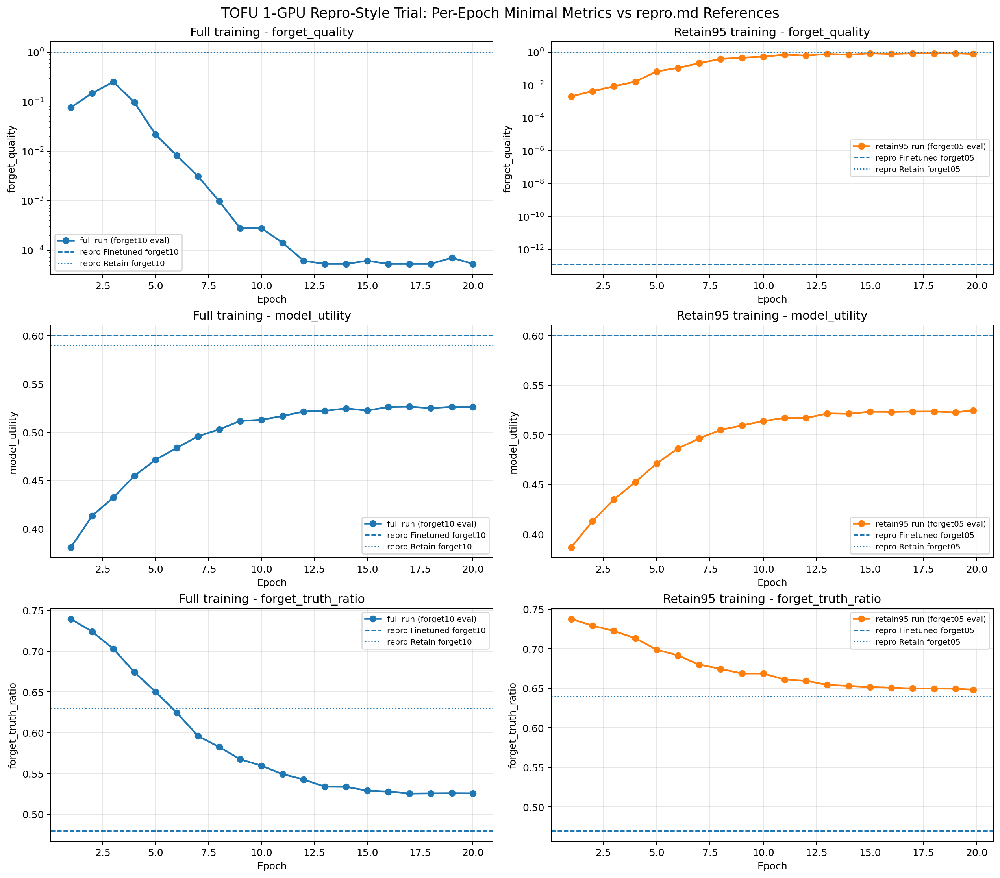

Final epoch snapshots (exact values from `trainer_state.json`):

- Full run (epoch 20.0, step 2500):
  - forget_quality: 5.297135868452869e-05
  - model_utility: 0.5261563382306292
  - forget_truth_ratio: 0.5257860518630928
- Retain95 run (epoch 19.833684210526314, step 2360):
  - forget_quality: 0.7933622419382523
  - model_utility: 0.5248117029435289
  - forget_truth_ratio: 0.6480636466386968

Readout:

- The retain95 trajectory converges close to the repro retain95 target on `forget_truth_ratio` (0.6481 vs 0.64) but remains below target on `model_utility` (0.5248 vs 0.60).
- The retain95 `forget_quality` curve trends toward the retain target band and ends at 0.7934, still below the repro reference line at 1.0.
- The full-data trajectory ends far from the repro finetuned forget10 `forget_quality` reference (5.297e-05 vs 1.66e-21), while utility also stays below its 0.60 reference.
- Overall, with the 1-GPU/20-epoch shape and minimal epoch eval, retain95 appears directionally closer to retain targets than full is to finetuned forget10 targets.

### Full run - full epoch table

| epoch | step | forget_quality | model_utility | forget_truth_ratio |
| ---: | ---: | ---: | ---: | ---: |
| 1.0 | 125 | 0.07729703110863351 | 0.38097683985325087 | 0.7395280760914379 |
| 2.0 | 250 | 0.1496667455389953 | 0.413589475413259 | 0.7240542585732151 |
| 3.0 | 375 | 0.2522454993330042 | 0.43237435958267656 | 0.702919589965618 |
| 4.0 | 500 | 0.09717419210545113 | 0.45499242376602833 | 0.6742912111624121 |
| 5.0 | 625 | 0.021621511070502353 | 0.4716041314449496 | 0.6501668008425845 |
| 6.0 | 750 | 0.008188327465790023 | 0.4838723619399575 | 0.6246181621430438 |
| 7.0 | 875 | 0.0031393851620755172 | 0.49585890682584777 | 0.5960146602548142 |
| 8.0 | 1000 | 0.0009830037004284497 | 0.5029595044347214 | 0.5825620210583364 |
| 9.0 | 1125 | 0.0002776483478232743 | 0.5116928000874027 | 0.5674872780392336 |
| 10.0 | 1250 | 0.0002776483478232743 | 0.5129346279290091 | 0.5596752861866118 |
| 11.0 | 1375 | 0.00014185795250665084 | 0.5168560754993405 | 0.5492365690906368 |
| 12.0 | 1500 | 6.117365052470201e-05 | 0.5214526170278064 | 0.5426611557836307 |
| 13.0 | 1625 | 5.297135868452869e-05 | 0.5221457895446731 | 0.5339176681301853 |
| 14.0 | 1750 | 5.297135868452869e-05 | 0.5247296088072895 | 0.5337052812008642 |
| 15.0 | 1875 | 6.117365052470201e-05 | 0.5224553265374027 | 0.5289633890330552 |
| 16.0 | 2000 | 5.297135868452869e-05 | 0.5262665724631335 | 0.5278198980024491 |
| 17.0 | 2125 | 5.297135868452869e-05 | 0.5265186553836647 | 0.5255063819531325 |
| 18.0 | 2250 | 5.297135868452869e-05 | 0.5250654429413601 | 0.525758949021565 |
| 19.0 | 2375 | 7.056941846253083e-05 | 0.5263547680928008 | 0.5259270559033312 |
| 20.0 | 2500 | 5.297135868452869e-05 | 0.5261563382306292 | 0.5257860518630928 |

### Retain95 run - full epoch table

| epoch | step | forget_quality | model_utility | forget_truth_ratio |
| ---: | ---: | ---: | ---: | ---: |
| 1.0 | 119 | 0.0020827633834865906 | 0.3868265408310892 | 0.7375928029797586 |
| 2.0 | 238 | 0.004304993380033157 | 0.41317556940973715 | 0.7291852766685974 |
| 3.0 | 357 | 0.008539483949831865 | 0.43506585151670923 | 0.7224134016015702 |
| 4.0 | 476 | 0.016258459276759563 | 0.45244097892584284 | 0.7133529512426173 |
| 5.0 | 595 | 0.06801920461119272 | 0.47128788787415316 | 0.6988299137817353 |
| 6.0 | 714 | 0.11228360286766195 | 0.4863538186371114 | 0.6914891104985671 |
| 7.0 | 833 | 0.220541217580421 | 0.496499477905457 | 0.6798389314248027 |
| 8.0 | 952 | 0.39352743357720954 | 0.5050899752780647 | 0.6744825036592365 |
| 9.0 | 1071 | 0.46628639073563594 | 0.509485797921211 | 0.6687306462855102 |
| 10.0 | 1190 | 0.5452713464323318 | 0.5139610574015684 | 0.6687251423794919 |
| 11.0 | 1309 | 0.7125821300149116 | 0.5171632492233942 | 0.660987236236065 |
| 12.0 | 1428 | 0.6284308022715471 | 0.5169935103075954 | 0.6595435635458212 |
| 13.0 | 1547 | 0.7933622419382523 | 0.5216449103813727 | 0.6542706659996302 |
| 14.0 | 1666 | 0.7125821300149116 | 0.5212920283893854 | 0.652959771560699 |
| 15.0 | 1785 | 0.8655265369450457 | 0.5233696242474899 | 0.6515823688268734 |
| 16.0 | 1904 | 0.7933622419382523 | 0.5231269569202935 | 0.6506717621467237 |
| 17.0 | 2023 | 0.8655265369450457 | 0.5235041785920019 | 0.6497530127500025 |
| 18.0 | 2142 | 0.8655265369450457 | 0.523543062244965 | 0.649605769676541 |
| 19.0 | 2261 | 0.8655265369450457 | 0.522676239617267 | 0.6494457027418412 |
| 19.833684210526314 | 2360 | 0.7933622419382523 | 0.5248117029435289 | 0.6480636466386968 |

## 25 May 2026 - 2xL40S Retain95 Repro Trial (Blocked)

Goal for this session:

- Run a single retain95 trial with repro-style distributed setup and hyperparameters, then compare only `forget_quality`, `model_utility`, and `forget_truth_ratio` against repro retain95 targets (`1.0`, `0.63`, `0.67`).

Target setup used:

- Hardware: 2 x L40S (Modal)
- Distributed: Accelerate + DeepSpeed ZeRO-3 (`configs/accelerate/default_config.yaml`)
- Core hyperparameters: `lr=1e-5`, per-device batch `8`, `grad_accum=4`, `epochs=10`, `optim=paged_adamw_32bit`
- Scope: no in-train eval; post-train minimal TOFU eval only (`configs/eval/tofu_minimal.yaml`)

Runs attempted (all detached Modal apps, all stopped after stall):

- `ap-BGwNjyFGIaxR3SLxqrSTQk`: initial 2-GPU repro trial.
- `ap-98MRMOlCqVSyzgeW2XvQJR`: removed non-repro CLI overrides (`gradient_checkpointing`, `ddp_find_unused_parameters`) to stay closer to baseline config.
- `ap-uSlCarw3y26ZGJd31w81pJ`: switched attention backend to `sdpa` (kept hyperparameters unchanged).
- `ap-Yy69nZFEZFcCt8pUbJ69pI`: `sdpa` + NCCL-safe transport flags (`NCCL_P2P_DISABLE=1`, `NCCL_IB_DISABLE=1`, `NCCL_SHM_DISABLE=1`).

Shared observed behavior across attempts:

- Startup proceeded through model load and DeepSpeed init.
- Training progress remained at `0/590` and did not advance.
- No hard traceback was emitted.
- Repeated warning in logs: Accelerate detected kernel version `4.4.0` (below recommended `5.5.0`) and warned this can cause hangs.

Outcome:

- Session concluded without a completed 2-GPU repro run and without new metric outputs for the retain95 comparison.
- Most likely blocker is runtime/kernel-level distributed hang in current Modal environment, not obvious hyperparameter mismatch.

## Integrated Personal Log Notes (May 18-24, 2026)

This section captures the higher-detail narrative context used to drive the experiments below.

### 18 May 2026 - Literature Review

- The WMDP Benchmark: Measuring and Reducing Malicious Use With Unlearning (RMU intro and WMDP dataset context).
- Quote captured in notes: "In contrast to unlearning for copyright or privacy, we do not assume access to questions from WMDP. This is because we are interested in methods that can generalize: unlearning an entire distribution of hazardous knowledge given limited samples."
- RMU mechanism notes: fine-tunes by changing loss function to pull a chosen forget set to a random vector, plus a pull to keep weights close to frozen weights.
- Outcome notes: random outputs to QA and probes with only slightly above-random accuracy.
- Critical commentary noted: "Unlearning via RMU is mostly shallow" (LessWrong).
- Follow-up note: direction of injected noise could be uncovered/reversed; coherence improved but remained worse than base model.
- NPO paper notes: Negative Preference Optimization: From Catastrophic Collapse to Effective Unlearning.
- NPO framing note: essentially DPO-style tuning toward "doesn't know" behavior on harmful queries.
- Additional paper notes: gradient ascent can cause collapse; refusal behavior may be mediated by a single direction.

### 19 May 2026 - Meeting Notes

- Send reading info.
- Go in one direction.
- Sharpen threat model.
- Realism requirement can be "more realistic" rather than fully realistic.
- Choose concrete model/dataset.
- Build slide deck.
- Make MVP.
- Start with one unlearning method.
- Always sanity-check with a small number of training steps first.
- Check outputs early.
- Claude Code experience considered useful signal for field work.
- Use TRL for training (SFT and RL options).
- Iliad fellowship noted as theoretical pathway.
- PhD noted as important for fellowship competitiveness.
- Apply to Rapid Grant Fund.
- Tinker toward larger models over time.
- Black-box methods and alternative evals flagged as useful for CV-building.

### 20 May 2026 - Execution Constraints and Threat Model Expansion

- Local run constraint: setup did not work on Mac.
- Planned matrix (as logged): 12 model checkpoints across (GA, NPU, RMU, Unseen) x (1%, 5%, 10% unlearned/unseen).
- Planned data scaling: 5% to 100% of unlearned/unseen data, with exact splits varying by holdout amount.
- Added threat model dimension: can an adversary recover unlearned information "for free" by retraining on a subset of unlearned data?
- Compute vendor exploration: asked Jazon which service is best; vast.ai considered.

### 24 May 2026 - Session Recap Integrated

#### Goal and approach

- Goal: close the gap between local TOFU finetune and HF reference on Llama-3.2-1B-Instruct.
- Initial issue: local model underperformed HF reference, especially on memorization-heavy metrics.
- Strategy:
  - Verify run behavior and epoch configuration.
  - Compare local model vs HF reference under matched eval setup.
  - Build fast sweep workflow (single post-train eval; no per-epoch eval during training).
  - Iterate targeted hyperparameter sweeps.
  - Debug harness/runtime failures.
  - Validate structural hypotheses (dataset loading, masking, effective-batch effects).

#### Engineering/debug changes

- Added scripts:
  - tofu_finetune_sweep.sh
  - modal_tofu_finetune_sweep_llama32_1b.py
  - modal_tofu_data_sanity_llama32_1b.py
  - analyze_tofu_sweep_results.py
- Updated copilot-instructions.md.
- Fixed earlier bf16 eval conversion bug in utils.py.
- Sweep harness fixes:
  - Removed jq dependency in container.
  - Fixed inline Python indentation bug after eval.
  - Added run-name uniqueness (bs, ga, lr, warmup, wd, epochs) to prevent artifact collisions.

#### Structural check findings

- TOFU full-train split sanity:
  - dataset_len: 4000
  - avg_input_len: 87.46
  - avg_supervised_tokens: 25.97
  - min_supervised_tokens: 10
  - pct_zero_supervised: 0.0
- Interpretation: dataset coverage and supervision masking looked healthy; no evidence of zero-label training failure.

#### Reference vs baseline snapshot (as logged)

| run | model_utility | forget_Q_A_Prob | forget_Q_A_ROUGE | forget_truth_ratio | extraction_strength | privleak | forget_quality |
| --- | ---: | ---: | ---: | ---: | ---: | ---: | ---: |
| HF reference | 0.599465 | 0.880518 | 0.816257 | 0.475623 | 0.705428 | -99.369540 | 0.0000187533 |
| Initial local baseline | 0.428002 | 0.270526 | 0.417651 | 0.706353 | 0.074442 | -11.899646 | 0.268067 |

#### Sweep highlights (as logged)

| run | epochs | bs | ga | lr | warmup | wd | model_utility | forget_Q_A_Prob | forget_Q_A_ROUGE | forget_truth_ratio | extraction_strength | privleak | forget_quality |
| --- | ---: | ---: | ---: | ---: | ---: | ---: | ---: | ---: | ---: | ---: | ---: | ---: | ---: |
| sweep_lr1e5_wu02_e5 | 5 | 8 | 4 | 1e-5 | 0.2 | 0.01 | 0.426021 | 0.265581 | 0.418115 | 0.708737 | 0.074385 | -9.144628 | 0.301836 |
| sweep_lr1e5_wu02_wd00_e10 | 10 | 8 | 4 | 1e-5 | 0.2 | 0.0 | 0.471123 | 0.326716 | 0.430355 | 0.645693 | 0.088793 | -44.301063 | 0.025949 |
| sweep_lr1e5_wu02_wd001_e10 | 10 | 8 | 4 | 1e-5 | 0.2 | 0.01 | 0.447500 | 0.291354 | 0.419054 | 0.684353 | 0.081262 | -24.358323 | 0.208921 |
| sweep_bs8_ga8_lr1e5_wu02_wd00_e10 | 10 | 8 | 8 | 1e-5 | 0.2 | 0.0 | 0.447500 | 0.291354 | 0.419054 | 0.684353 | 0.081262 | -24.358323 | 0.208921 |
| sweep_bs8_ga4_lr12e5_wu01_wd00_e10 | 10 | 8 | 4 | 1.2e-5 | 0.1 | 0.0 | 0.495837 | 0.383762 | 0.441992 | 0.586985 | 0.105096 | -68.712515 | 0.000680 |
| sweep_bs8_ga4_lr12e5_wu02_wd00_e10 | 10 | 8 | 4 | 1.2e-5 | 0.2 | 0.0 | 0.498012 | 0.387053 | 0.439671 | 0.586186 | 0.107418 | -69.344746 | 0.000600 |
| sweep_bs8_ga4_lr12e5_wu02_wd001_e10 | 10 | 8 | 4 | 1.2e-5 | 0.2 | 0.01 | 0.498012 | 0.387053 | 0.439671 | 0.586186 | 0.107418 | -69.344746 | 0.000600 |
| sweep_bs8_ga4_lr12e5_wu03_wd00_e10 | 10 | 8 | 4 | 1.2e-5 | 0.3 | 0.0 | 0.496945 | 0.390083 | 0.442868 | 0.585701 | 0.108328 | -70.048406 | 0.000600 |
| sweep_bs8_ga4_lr15e5_wu02_wd00_e10 | 10 | 8 | 4 | 1.5e-5 | 0.2 | 0.0 | 0.526107 | 0.520273 | 0.485083 | 0.512687 | 0.156160 | -92.291617 | 0.0000161 |
| sweep_bs8_ga4_lr20e5_wu02_wd00_e10 | 10 | 8 | 4 | 2e-5 | 0.2 | 0.0 | 0.571677 | 0.837734 | 0.758163 | 0.439483 | 0.573487 | -99.206612 | 0.0000138 |

#### Best result (as logged)

- Best config:
  - epochs=10
  - bs=8
  - ga=4
  - lr=2e-5
  - warmup=0.2
  - wd=0.0
- Best run file: sweep_bs8_ga4_lr20e5_wu02_wd00_e10.json
- Near-HF closeness called out in notes:
  - forget_Q_A_Prob: 0.8377 vs 0.8805
  - privleak: -99.2066 vs -99.3695
  - forget_Q_A_ROUGE: 0.7582 vs 0.8163

## Canonical Sources

- Full-eval run ledger: experiments/run_ledger/run_ledger.csv
- Epoch trajectory summaries: experiments/run_summaries/light_eval_lr2e5_e15/TOFU_SUMMARY_ckpt_*.json
- App status snapshots: modal app list --json

## Latest Modal Status Snapshot

As of latest check, there were no active runs.

Recent apps listed:

| app_id | description | state | created_at | stopped_at |
| --- | --- | --- | --- | --- |
| ap-ypSe8huvupsZSNetIRANcB | open-unlearning-tofu-finetune-llama32-1b | stopped | 2026-05-25 17:48:21-04:00 | 2026-05-25 18:22:13-04:00 |
| ap-MIUZmiRaHwBsqU76cWmqH0 | open-unlearning-tofu-finetune-llama32-1b | stopped | 2026-05-25 17:44:18-04:00 | 2026-05-25 17:47:02-04:00 |

## Repro Comparison (Llama-3.2-1B-Instruct, 2026-05-25)

Reference: docs/repro.md table "TOFU unlearning on the Llama-3.2-1B-Instruct architecture" for the Finetuned and Retain rows.

Observed metrics were read from:

- saves/eval/tofu_Llama-3.2-1B-Instruct_full/evals_forget01/TOFU_EVAL.json
- saves/eval/tofu_Llama-3.2-1B-Instruct_full/evals_forget05/TOFU_EVAL.json
- saves/eval/tofu_Llama-3.2-1B-Instruct_full/evals_forget10/TOFU_EVAL.json
- saves/eval/tofu_Llama-3.2-1B-Instruct_retain99/TOFU_EVAL.json
- saves/eval/tofu_Llama-3.2-1B-Instruct_retain95/TOFU_EVAL.json
- saves/eval/tofu_Llama-3.2-1B-Instruct_retain90/TOFU_EVAL.json
- modal volume path /eval/tofu_Llama-3.2-1B-Instruct_retain99/evals_forget01_retainref/TOFU_EVAL.json (downloaded to tmp/modal_retainref/retain99_eval.json)
- modal volume path /eval/tofu_Llama-3.2-1B-Instruct_retain95/evals_forget05_retainref/TOFU_EVAL.json (downloaded to tmp/modal_retainref/retain95_eval.json)
- modal volume path /eval/tofu_Llama-3.2-1B-Instruct_retain90/evals_forget10_retainref/TOFU_EVAL.json (downloaded to tmp/modal_retainref/retain90_eval.json)

### Finetuned row (full model)

| split | metric | repro.md | observed | delta (observed - repro) |
| --- | --- | ---: | ---: | ---: |
| forget01 | forget_quality | 0.01 | 0.006760732303569208 | -0.003239267696430792 |
| forget01 | model_utility | 0.60 | 0.5991534707368931 | -0.0008465292631069 |
| forget01 | forget_truth_ratio | 0.47 | 0.47275169797934485 | +0.00275169797934484 |
| forget05 | forget_quality | 1.33e-13 | 1.4275699621532978e-12 | +1.2945699621532978e-12 |
| forget05 | model_utility | 0.60 | 0.5991534707368931 | -0.0008465292631069 |
| forget05 | forget_truth_ratio | 0.47 | 0.47251418603988127 | +0.00251418603988126 |
| forget10 | forget_quality | 1.66e-21 | 3.9054713571083378e-22 | -1.2694528642891663e-21 |
| forget10 | model_utility | 0.60 | 0.5991534707368931 | -0.0008465292631069 |
| forget10 | forget_truth_ratio | 0.48 | 0.475563896242435 | -0.00443610375756501 |

Assessment: full-model Finetuned metrics are close to repro targets across all three splits. Model utility matches within about 8.5e-4, and forget_truth_ratio is within about 4.5e-3.

### Retain row (retain99/retain95/retain90)

| split | metric | repro.md | observed | delta (observed - repro) |
| --- | --- | ---: | ---: | ---: |
| forget01 (retain99) | forget_quality | 1.00 | 0.9900193288833089 | -0.00998067111669109 |
| forget01 (retain99) | model_utility | 0.60 | 0.570212453594976 | -0.0297875464050239 |
| forget01 (retain99) | forget_truth_ratio | 0.65 | 0.6271750302504028 | -0.0228249697495972 |
| forget05 (retain95) | forget_quality | 1.00 | 0.5452713464323318 | -0.454728653567668 |
| forget05 (retain95) | model_utility | 0.60 | 0.5664466333681196 | -0.0335533666318804 |
| forget05 (retain95) | forget_truth_ratio | 0.64 | 0.5963963766541205 | -0.0436036233458796 |
| forget10 (retain90) | forget_quality | 1.00 | 0.5234101030810641 | -0.476589896918936 |
| forget10 (retain90) | model_utility | 0.59 | 0.5715158551196952 | -0.0184841448803048 |
| forget10 (retain90) | forget_truth_ratio | 0.63 | 0.5991156922071371 | -0.0308843077928629 |

Assessment (completed retainref reruns): retain99 remains fairly close on forget_quality (0.99 vs 1.0) but utility/truth-ratio are lower than repro targets; retain95 and retain90 are not close to repro for forget_quality and are also lower on model_utility and forget_truth_ratio.

### Follow-up diagnostics for retain95/retain90 forget_quality drop

Checks requested and outcome:

- Correct retain reference logs used for KS-test in forget_quality:
  - retain95 retainref run logs show loading from saves/eval/tofu_Llama-3.2-1B-Instruct_retain95/TOFU_EVAL.json.
  - retain90 retainref run logs show loading from saves/eval/tofu_Llama-3.2-1B-Instruct_retain90/TOFU_EVAL.json.
  - Conclusion: no retain_logs_path mix-up was detected.

- Undertraining hypothesis check from trainer_state.json (downloaded from Modal volume):
  - retain99: num_train_epochs=10, global_step=max_steps=1230, loss 2.6113 -> 0.2037.
  - retain95: num_train_epochs=10, global_step=max_steps=1180, loss 2.6041 -> 0.1940.
  - retain90: num_train_epochs=10, global_step=max_steps=1120, loss 2.6232 -> 0.1935.
  - Conclusion: all three were trained for the same epoch count with smoothly converging losses; no obvious early-stop/undertraining signal.

Interpretation:

- The retain95/retain90 forget_quality failure is likely not a logging-path error and not a simple "run ended too early" issue.
- Most plausible remaining cause is hyperparameter mismatch for retain95/retain90 relative to repro settings (or split-specific retuning requirement), since these runs used the full-model selected recipe (lr=2e-5, warmup=0.2, wd=0.0) rather than the repro baseline recipe (lr=1e-5 and benchmark defaults).

## Full TOFU Eval Ledger (All Completed Rows)

| run_id | source | epochs | batch_size | grad_accum | lr | warmup | weight_decay | model_utility | forget_Q_A_Prob | forget_Q_A_ROUGE | forget_truth_ratio | extraction_strength | privleak | forget_quality |
| --- | --- | --- | --- | --- | --- | --- | --- | ---: | ---: | ---: | ---: | ---: | ---: | ---: |
| hf_reference | reference |  |  |  |  |  |  | 0.5994651457788788 | 0.880517578125 | 0.8162573581836505 | 0.47562251465473776 | 0.7054281424181021 | -99.36953953258663 | 0.00001875326531411517 |
| local_modal_ref_initial | baseline | 5 | 4 | 8 | 1e-5 | 1.0 | 0.01 | 0.42800244405795773 | 0.270526123046875 | 0.41765138484504044 | 0.7063533854267569 | 0.07444155981810466 | -11.899645806488863 | 0.26806721922474674 |
| sweep_bs8_ga4_lr12e5_wu01_wd00_e10 | sweep | 10 | 8 | 4 | 1.2e-5 | 0.1 | 0.0 | 0.49583713299199444 | 0.38376220703125 | 0.4419915770632358 | 0.5869849212156367 | 0.10509619384057473 | -68.71251474498938 | 0.0006801164620201692 |
| sweep_bs8_ga4_lr12e5_wu02_wd00_e10 | sweep | 10 | 8 | 4 | 1.2e-5 | 0.2 | 0.0 | 0.49801177501530824 | 0.38705322265625 | 0.439670516104406 | 0.5861864995150864 | 0.10741761531452855 | -69.34474614982862 | 0.0006002877075413837 |
| sweep_bs8_ga4_lr12e5_wu02_wd001_e10 | sweep | 10 | 8 | 4 | 1.2e-5 | 0.2 | 0.01 | 0.49801177501530824 | 0.38705322265625 | 0.439670516104406 | 0.5861864995150864 | 0.10741761531452855 | -69.34474614982862 | 0.0006002877075413837 |
| sweep_bs8_ga4_lr12e5_wu03_wd00_e10 | sweep | 10 | 8 | 4 | 1.2e-5 | 0.3 | 0.0 | 0.496945087612705 | 0.3900830078125 | 0.44286819047552695 | 0.5857008274258731 | 0.10832752137414509 | -70.04840612608292 | 0.0006002877075413837 |
| sweep_bs8_ga4_lr15e5_wu02_wd00_e10 | sweep | 10 | 8 | 4 | 1.5e-5 | 0.2 | 0.0 | 0.5261070579137321 | 0.5202734375 | 0.4850834411012457 | 0.5126865190580557 | 0.15616021585222578 | -92.29161745600159 | 0.000016096712589488792 |
| sweep_bs8_ga4_lr20e5_wu02_wd00_e10 | sweep | 10 | 8 | 4 | 2e-5 | 0.2 | 0.0 | 0.5716766826960987 | 0.837734375 | 0.7581630145832531 | 0.43948298508448913 | 0.5734865409206367 | -99.2066115515076 | 0.000013801118266440507 |
| sweep_bs8_ga8_lr1e5_wu02_wd00_e10 | sweep | 10 | 8 | 8 | 1e-5 | 0.2 | 0.0 | 0.4474996349352546 | 0.291353759765625 | 0.41905374354293307 | 0.6843525345645233 | 0.08126209061932549 | -24.358323490085795 | 0.20892056350855645 |
| sweep_lr1e5_wu02_e5 | sweep | 5 | 8 | 4 | 1e-5 | 0.2 | 0.01 | 0.42602068678598837 | 0.2655810546875 | 0.41811463201643356 | 0.7087371515792804 | 0.07438515858410771 | -9.14462809744613 | 0.30183559687012357 |
| sweep_lr1e5_wu02_wd00_e10 | sweep | 10 | 8 | 4 | 1e-5 | 0.2 | 0.0 | 0.47112298252428186 | 0.32671630859375 | 0.4303545014174692 | 0.6456932631567153 | 0.08879275448465754 | -44.301062565421304 | 0.025948831853476385 |
| sweep_lr1e5_wu02_wd001_e10 | sweep | 10 | 8 | 4 | 1e-5 | 0.2 | 0.01 | 0.4474996349352546 | 0.291353759765625 | 0.41905374354293307 | 0.6843525345645233 | 0.08126209061932549 | -24.358323490085795 | 0.20892056350855645 |
| sweep_bs8_ga4_lr25e5_wu02_wd00_e10 | sweep | 10 | 8 | 4 | 2.5e-5 | 0.2 | 0.0 | 0.5786577746788673 | 0.977861328125 | 0.9857803091906814 | 0.4255177705061971 | 0.9837217605778328 | -99.98937424321335 | 0.00003416894352390563 |
| sweep_bs8_ga4_lr30e5_wu02_wd00_e10 | sweep | 10 | 8 | 4 | 3e-5 | 0.2 | 0.0 | 0.5768196293723318 | 0.9936328125 | 1.0 | 0.43031435664093093 | 0.9994354838709677 | -99.9999999811098 | 0.00005297135868452869 |

## Sweep Ranking vs HF Reference

Score definition: mean relative gap over {model_utility, forget_Q_A_Prob, forget_Q_A_ROUGE, forget_truth_ratio, extraction_strength, privleak}. Lower is better.

| rank | run_id | epochs | bs | ga | lr | warmup | wd | score | model_utility | forget_Q_A_Prob | forget_Q_A_ROUGE | forget_truth_ratio | extraction_strength | privleak | forget_quality |
| ---: | --- | ---: | ---: | ---: | --- | ---: | ---: | ---: | ---: | ---: | ---: | ---: | ---: | ---: | ---: |
| 1 | sweep_bs8_ga4_lr20e5_wu02_wd00_e10 | 10 | 8 | 4 | 2e-5 | 0.2 | 0.0 | 0.071796 | 0.5716766826960987 | 0.837734375 | 0.7581630145832531 | 0.43948298508448913 | 0.5734865409206367 | -99.2066115515076 | 0.000013801118266440507 |
| 2 | sweep_bs8_ga4_lr25e5_wu02_wd00_e10 | 10 | 8 | 4 | 2.5e-5 | 0.2 | 0.0 | 0.143172 | 0.5786577746788673 | 0.977861328125 | 0.9857803091906814 | 0.4255177705061971 | 0.9837217605778328 | -99.98937424321335 | 0.00003416894352390563 |
| 3 | sweep_bs8_ga4_lr30e5_wu02_wd00_e10 | 10 | 8 | 4 | 3e-5 | 0.2 | 0.0 | 0.151621 | 0.5768196293723318 | 0.9936328125 | 1.0 | 0.43031435664093093 | 0.9994354838709677 | -99.9999999811098 | 0.00005297135868452869 |
| 4 | sweep_bs8_ga4_lr15e5_wu02_wd00_e10 | 10 | 8 | 4 | 1.5e-5 | 0.2 | 0.0 | 0.310835 | 0.5261070579137321 | 0.5202734375 | 0.4850834411012457 | 0.5126865190580557 | 0.15616021585222578 | -92.29161745600159 | 0.000016096712589488792 |
| 5 | sweep_bs8_ga4_lr12e5_wu03_wd00_e10 | 10 | 8 | 4 | 1.2e-5 | 0.3 | 0.0 | 0.426399 | 0.496945087612705 | 0.3900830078125 | 0.44286819047552695 | 0.5857008274258731 | 0.10832752137414509 | -70.04840612608292 | 0.0006002877075413837 |
| 6 | sweep_bs8_ga4_lr12e5_wu02_wd00_e10 | 10 | 8 | 4 | 1.2e-5 | 0.2 | 0.0 | 0.428894 | 0.49801177501530824 | 0.38705322265625 | 0.439670516104406 | 0.5861864995150864 | 0.10741761531452855 | -69.34474614982862 | 0.0006002877075413837 |
| 7 | sweep_bs8_ga4_lr12e5_wu02_wd001_e10 | 10 | 8 | 4 | 1.2e-5 | 0.2 | 0.01 | 0.428894 | 0.49801177501530824 | 0.38705322265625 | 0.439670516104406 | 0.5861864995150864 | 0.10741761531452855 | -69.34474614982862 | 0.0006002877075413837 |
| 8 | sweep_bs8_ga4_lr12e5_wu01_wd00_e10 | 10 | 8 | 4 | 1.2e-5 | 0.1 | 0.0 | 0.431536 | 0.49583713299199444 | 0.38376220703125 | 0.4419915770632358 | 0.5869849212156367 | 0.10509619384057473 | -68.71251474498938 | 0.0006801164620201692 |
| 9 | sweep_lr1e5_wu02_wd00_e10 | 10 | 8 | 4 | 1e-5 | 0.2 | 0.0 | 0.516950 | 0.47112298252428186 | 0.32671630859375 | 0.4303545014174692 | 0.6456932631567153 | 0.08879275448465754 | -44.301062565421304 | 0.025948831853476385 |
| 10 | sweep_bs8_ga8_lr1e5_wu02_wd00_e10 | 10 | 8 | 8 | 1e-5 | 0.2 | 0.0 | 0.581293 | 0.4474996349352546 | 0.291353759765625 | 0.41905374354293307 | 0.6843525345645233 | 0.08126209061932549 | -24.358323490085795 | 0.20892056350855645 |
| 11 | sweep_lr1e5_wu02_wd001_e10 | 10 | 8 | 4 | 1e-5 | 0.2 | 0.01 | 0.581293 | 0.4474996349352546 | 0.291353759765625 | 0.41905374354293307 | 0.6843525345645233 | 0.08126209061932549 | -24.358323490085795 | 0.20892056350855645 |
| 12 | sweep_lr1e5_wu02_e5 | 5 | 8 | 4 | 1e-5 | 0.2 | 0.01 | 0.628022 | 0.42602068678598837 | 0.2655810546875 | 0.41811463201643356 | 0.7087371515792804 | 0.07438515858410771 | -9.14462809744613 | 0.30183559687012357 |

### Sweep Learning-Rate Response (Relevant Cross-Run Trend)

Scope: runs with bs=8, ga=4, epochs=10, warmup=0.2, wd=0.0 (except where noted in the table above).

LR index mapping:

- 1 -> 1e-5
- 2 -> 1.2e-5
- 3 -> 1.5e-5
- 4 -> 2e-5
- 5 -> 2.5e-5
- 6 -> 3e-5

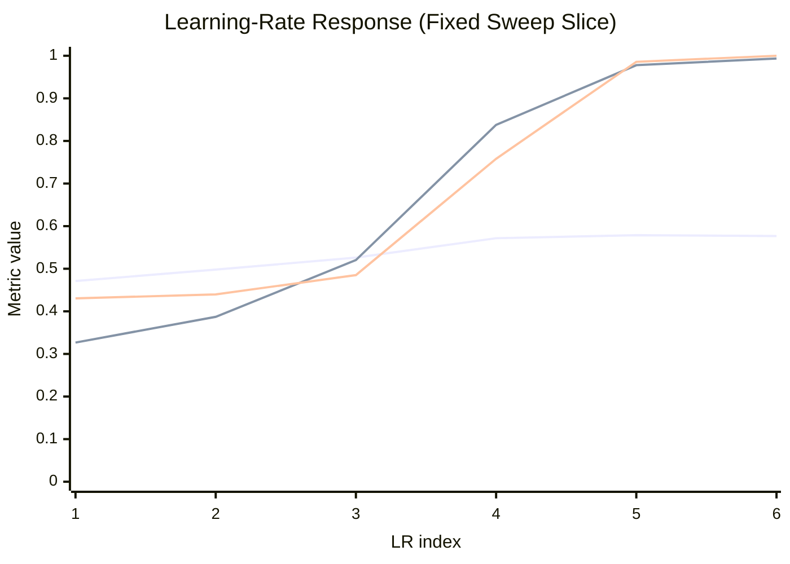
```mermaid
xychart-beta
  title "Learning-Rate Response (Fixed Sweep Slice)"
  x-axis "LR index" [1,2,3,4,5,6]
  y-axis "Metric value" 0 --> 1
  line "model_utility" [0.47112298252428186,0.49801177501530824,0.5261070579137321,0.5716766826960987,0.5786577746788673,0.5768196293723318]
  line "forget_Q_A_Prob" [0.32671630859375,0.38705322265625,0.5202734375,0.837734375,0.977861328125,0.9936328125]
  line "forget_Q_A_ROUGE" [0.4303545014174692,0.439670516104406,0.4850834411012457,0.7581630145832531,0.9857803091906814,1.0]
```

Readout:

- 2e-5 is the knee where utility is strong while memorization metrics are high but not yet maxed out.
- 2.5e-5 and 3e-5 further increase memorization metrics toward saturation with little utility gain.

## Per-Epoch Light-Eval Trajectory (lr=2e-5, warmup=0.2, wd=0.0, bs=8, ga=4)

Run folder: experiments/run_summaries/light_eval_lr2e5_e15

| epoch | step | forget_Q_A_Prob | forget_truth_ratio | extraction_strength | retain_Q_A_Prob |
| ---: | ---: | ---: | ---: | ---: | ---: |
| 1 | 125 | 0.293707685284 | 0.699687778309 | 0.087934838653 | 0.284668543637 |
| 2 | 250 | 0.386303995065 | 0.633954763328 | 0.115926081452 | 0.370596926659 |
| 3 | 375 | 0.497292820923 | 0.568013562546 | 0.156767755225 | 0.475759140998 |
| 4 | 500 | 0.629097478390 | 0.518142545802 | 0.251210208987 | 0.605117317513 |
| 5 | 625 | 0.755230638012 | 0.481634716934 | 0.409653532200 | 0.733608030081 |
| 6 | 750 | 0.851890308261 | 0.453931150007 | 0.612451397903 | 0.835661258996 |
| 7 | 875 | 0.908467264026 | 0.441088723278 | 0.782904806077 | 0.898815515339 |
| 8 | 1000 | 0.947494598925 | 0.429247888223 | 0.908548496298 | 0.937852275968 |
| 9 | 1125 | 0.967996070832 | 0.426173660280 | 0.961592815437 | 0.962306928784 |
| 10 | 1250 | 0.980365982354 | 0.421221670877 | 0.987744270858 | 0.975797757059 |
| 11 | 1375 | 0.986748316139 | 0.420122263581 | 0.996772246941 | 0.983182756603 |
| 12 | 1500 | 0.990134599060 | 0.415331311190 | 0.998927419355 | 0.987540551424 |
| 13 | 1625 | 0.991632748395 | 0.415124625552 | 0.999250000000 | 0.989610149413 |
| 14 | 1750 | 0.992108983099 | 0.414269175970 | 0.999250000000 | 0.990314004570 |
| 15 | 1875 | 0.992195585072 | 0.412698261649 | 0.999250000000 | 0.990412398577 |

### Per-Epoch Curves (Plateau Visualization)

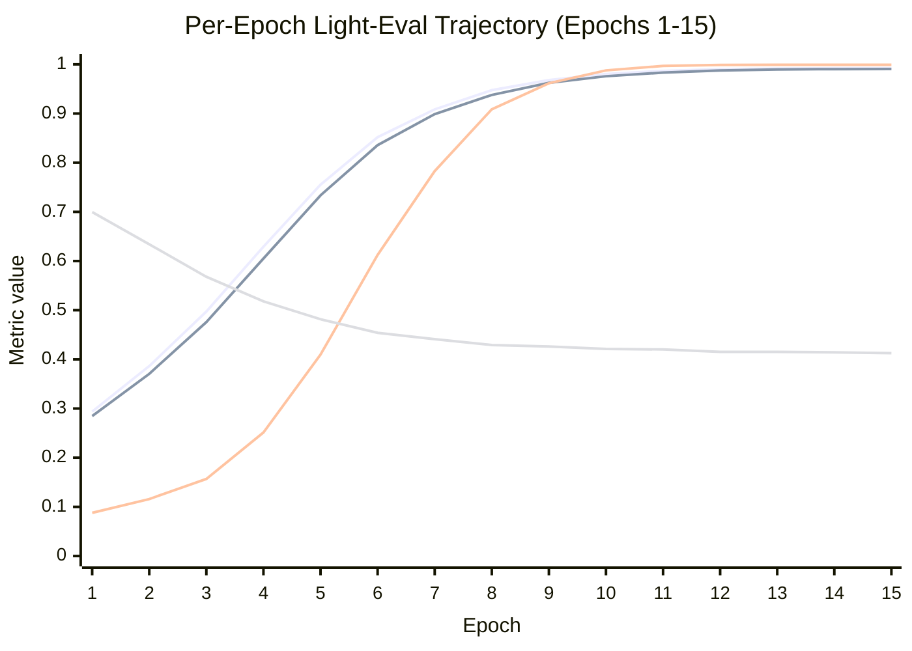
```mermaid
xychart-beta
  title "Per-Epoch Light-Eval Trajectory (Epochs 1-15)"
  x-axis "Epoch" [1,2,3,4,5,6,7,8,9,10,11,12,13,14,15]
  y-axis "Metric value" 0 --> 1
  line "forget_Q_A_Prob" [0.293707685284,0.386303995065,0.497292820923,0.629097478390,0.755230638012,0.851890308261,0.908467264026,0.947494598925,0.967996070832,0.980365982354,0.986748316139,0.990134599060,0.991632748395,0.992108983099,0.992195585072]
  line "retain_Q_A_Prob" [0.284668543637,0.370596926659,0.475759140998,0.605117317513,0.733608030081,0.835661258996,0.898815515339,0.937852275968,0.962306928784,0.975797757059,0.983182756603,0.987540551424,0.989610149413,0.990314004570,0.990412398577]
  line "extraction_strength" [0.087934838653,0.115926081452,0.156767755225,0.251210208987,0.409653532200,0.612451397903,0.782904806077,0.908548496298,0.961592815437,0.987744270858,0.996772246941,0.998927419355,0.999250000000,0.999250000000,0.999250000000]
  line "forget_truth_ratio" [0.699687778309,0.633954763328,0.568013562546,0.518142545802,0.481634716934,0.453931150007,0.441088723278,0.429247888223,0.426173660280,0.421221670877,0.420122263581,0.415331311190,0.415124625552,0.414269175970,0.412698261649]
```

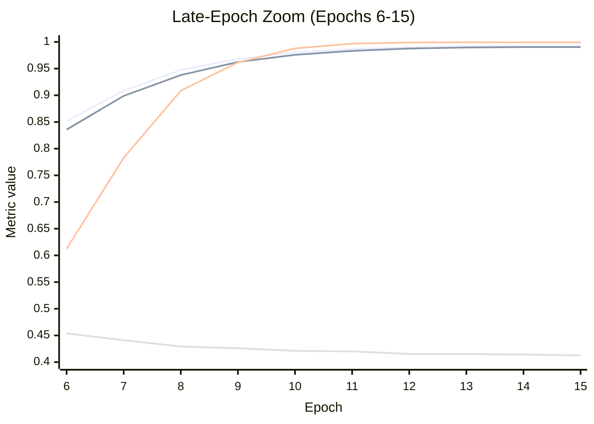
```mermaid
xychart-beta
  title "Late-Epoch Zoom (Epochs 6-15)"
  x-axis "Epoch" [6,7,8,9,10,11,12,13,14,15]
  y-axis "Metric value" 0.40 --> 1
  line "forget_Q_A_Prob" [0.851890308261,0.908467264026,0.947494598925,0.967996070832,0.980365982354,0.986748316139,0.990134599060,0.991632748395,0.992108983099,0.992195585072]
  line "retain_Q_A_Prob" [0.835661258996,0.898815515339,0.937852275968,0.962306928784,0.975797757059,0.983182756603,0.987540551424,0.989610149413,0.990314004570,0.990412398577]
  line "extraction_strength" [0.612451397903,0.782904806077,0.908548496298,0.961592815437,0.987744270858,0.996772246941,0.998927419355,0.999250000000,0.999250000000,0.999250000000]
  line "forget_truth_ratio" [0.453931150007,0.441088723278,0.429247888223,0.426173660280,0.421221670877,0.420122263581,0.415331311190,0.415124625552,0.414269175970,0.412698261649]
```

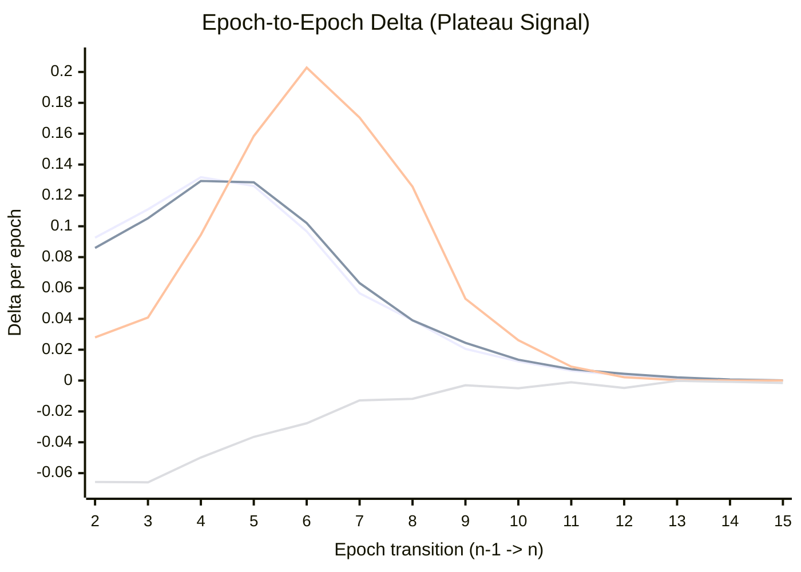
```mermaid
xychart-beta
  title "Epoch-to-Epoch Delta (Plateau Signal)"
  x-axis "Epoch transition (n-1 -> n)" [2,3,4,5,6,7,8,9,10,11,12,13,14,15]
  y-axis "Delta per epoch" -0.07 --> 0.21
  line "delta_forget_Q_A_Prob" [0.092596309781,0.110988825858,0.131804657467,0.126133159622,0.096659670249,0.056576955765,0.039027334899,0.020501471907,0.012369911522,0.006382333785,0.003386282921,0.001498149335,0.000476234704,0.000086601973]
  line "delta_retain_Q_A_Prob" [0.085928383022,0.105162214339,0.129358176515,0.128490712568,0.102053228915,0.063154256343,0.039036760629,0.024454652816,0.013490828275,0.007384999544,0.004357794821,0.002069597989,0.000703855157,0.000098394007]
  line "delta_extraction_strength" [0.027991242799,0.040841673773,0.094442453762,0.158443323213,0.202797865703,0.170453408174,0.125643690221,0.053044319139,0.026151455421,0.009027976083,0.002155172414,0.000322580645,0.0,0.0]
  line "delta_forget_truth_ratio" [-0.065733014981,-0.065941200782,-0.049871016744,-0.036507828868,-0.027703566927,-0.012842426729,-0.011840835055,-0.003074227943,-0.004951989403,-0.001099407296,-0.004790952391,-0.000206685638,-0.000855449582,-0.001570914321]
```

Plateau readout:

- The biggest gains occur in epochs 1-8.
- Diminishing returns are clear by epochs 9-10.
- Epochs 11-15 are near-flat for forget_Q_A_Prob, retain_Q_A_Prob, and extraction_strength.
- forget_truth_ratio continues to decrease after epoch 10, but with smaller per-epoch improvements than early training.

## Retain95 Minimal Per-Epoch Sweep (lr=2e-5, warmup=0.2, epochs=15, wd in {0.0, 0.1})

Run ids:

- finetune/tofu_Llama-3.2-1B-Instruct_retain95_light_eval_min_lr2e-05_wu0p2_wd0p0_e15
- finetune/tofu_Llama-3.2-1B-Instruct_retain95_light_eval_min_lr2e-05_wu0p2_wd0p1_e15

Metrics tracked each epoch (minimal eval): forget_quality, model_utility, forget_truth_ratio.

### Configuration sanity check

- wd0.0 run overrides include: trainer.args.weight_decay=0.0
- wd0.1 run overrides include: trainer.args.weight_decay=0.1

### Per-epoch results

Observation: wd0.0 and wd0.1 trajectories are numerically identical to printed precision across all logged epochs.

| epoch | step | forget_quality | model_utility | forget_truth_ratio |
| ---: | ---: | ---: | ---: | ---: |
| 1 | 119 | 0.006094418258803505 | 0.4228172942865552 | 0.7283443067551117 |
| 2 | 238 | 0.03956202584899502 | 0.47208082337120727 | 0.7075207248068532 |
| 3 | 357 | 0.220541217580421 | 0.5127848191354466 | 0.6780928164425578 |
| 4 | 476 | 0.8655265369450457 | 0.5442998768870129 | 0.6528209109600545 |
| 5 | 595 | 0.9238374197330625 | 0.5677633890697796 | 0.6286265375076985 |
| 6 | 714 | 0.5452713464323318 | 0.5790601203554501 | 0.6125438325724708 |
| 7 | 833 | 0.5452713464323318 | 0.5881470303952698 | 0.5979299668344928 |
| 8 | 952 | 0.6284308022715471 | 0.5878505664465311 | 0.5861354845762131 |
| 9 | 1071 | 0.2704743832803917 | 0.5787860446367419 | 0.5756861898307933 |
| 10 | 1190 | 0.46628639073563594 | 0.571378295625301 | 0.5733759433063313 |
| 11 | 1309 | 0.46628639073563594 | 0.5636635256905281 | 0.5709118074800206 |
| 12 | 1428 | 0.2704743832803917 | 0.5601507393715901 | 0.5640699276691336 |
| 13 | 1547 | 0.32811544409418575 | 0.5582804498110736 | 0.5586288926437293 |
| 14 | 1666 | 0.32811544409418575 | 0.5566516120743941 | 0.558743133287973 |
| 15 | 1770 | 0.32811544409418575 | 0.558415367577476 | 0.5567283482096733 |

### Per-epoch curves vs repro targets (Retain, forget05)

Repro targets from docs/repro.md (Llama-3.2-1B-Instruct, Retain row, forget05):

- forget_quality target: 1.0
- model_utility target: 0.6
- forget_truth_ratio target: 0.64

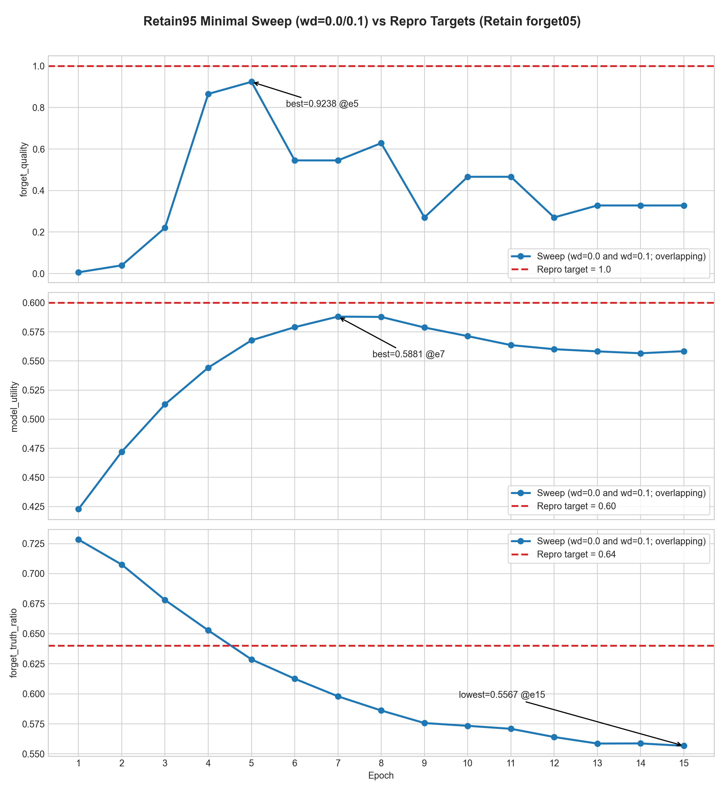

Graph readout:

- forget_quality never reaches the repro target line of 1.0 (closest at epoch 5: 0.9238).
- model_utility remains below the repro target line of 0.6 (peak at epoch 7: 0.5881).
- forget_truth_ratio crosses below the repro target of 0.64 by epoch 5 and keeps decreasing thereafter.

### Best points within this sweep slice

- Best forget_quality: epoch 5 (step 595), value 0.9238374197330625
- Best model_utility: epoch 7 (step 833), value 0.5881470303952698
- Lowest forget_truth_ratio: epoch 15 (step 1770), value 0.5567283482096733

Readout:

- No measurable benefit from wd=0.1 over wd=0.0 under this exact setup; curves overlap.
- The dominant dynamic is epoch selection: forget_quality peaks around epoch 5, while model_utility peaks later around epoch 7.

## 26 May 2026 - HF Variants Batch 2 (rmu3/rmu4/graddiff2/simnpo2/npo2) vs repro.md

Scope:

- Evaluated 5 Hugging Face checkpoints on TOFU forget10 using full `tofu.yaml` metric set.
- Output sources: `tmp/hf_eval_summaries2/*.json` (downloaded from Modal volume paths under `/eval/*_hf/TOFU_SUMMARY.json`).
- Repro comparison source: `docs/repro.md` table "TOFU unlearning on the Llama-3.2-1B-Instruct architecture" (forget10 columns).
- forget_quality reference logs for this batch were set to `saves/eval/tofu_Llama-3.2-1B-Instruct_retain90/TOFU_EVAL.json`.

### Full forget10 summary table

| model | forget_quality | model_utility | forget_truth_ratio | forget_Q_A_Prob | forget_Q_A_ROUGE | extraction_strength | privleak |
| --- | ---: | ---: | ---: | ---: | ---: | ---: | ---: |
| rmu3 | 0.0003254839625295495 | 0.02377649461787194 | 0.6225891210634452 | 0.008785300254821778 | 0.14365665626509075 | 0.033416027744897464 | -54.091332420223694 |
| rmu4 | 2.0132797133922014e-23 | 0.5882534063122767 | 0.46669555830614756 | 0.83375 | 0.7318995471355362 | 0.560402536951763 | -99.56267334541714 |
| graddiff2 | 3.966942318975938e-200 | 0.4137290161872861 | 0.00044545774602928605 | 1.7473636016802637e-05 | 0.020705437116130397 | 0.03250892997513522 | 61.92828651990391 |
| simnpo2 | 8.080285566431044e-22 | 0.5967848432473672 | 0.4656523473885603 | 0.8374951171875 | 0.7253799466964179 | 0.5505447263702316 | -99.35615798840178 |
| npo2 | 0.0001305755477065129 | 0.4322202580646987 | 0.6409680480063733 | 0.20778778076171875 | 0.1858173753282933 | 0.09544282504763273 | -52.42453077646947 |

### Comparison to repro.md (forget10 columns)

| method | repro_method | ours forget_quality | repro forget_quality | log10(ours/repro) | delta model_utility | delta forget_truth_ratio |
| --- | --- | ---: | ---: | ---: | ---: | ---: |
| rmu3 | RMU | 0.0003254839625295495 | 3.15e-15 | 11.01421904078432 | -0.5662235053821281 | -0.1374108789365548 |
| rmu4 | RMU | 2.0132797133922014e-23 | 3.15e-15 | -8.194406436355674 | -0.0017465936877232302 | -0.29330444169385245 |
| graddiff2 | GradDiff | 3.966942318975938e-200 | 1.06e-239 | 39.573150020429296 | -0.07627098381271391 | 0.00044545774602928605 |
| simnpo2 | SimNPO | 8.080285566431044e-22 | 2.47e-203 | 181.51472975624435 | 0.05678484324736721 | 0.46564164738856034 |
| npo2 | NPO | 0.0001305755477065129 | 0.02 | -2.1851681394783857 | -0.027779741935301305 | -0.05903195199362665 |

Readout:

- `rmu3` under this config is a clear outlier with a severe utility drop (`model_utility=0.0238`), far below repro RMU (`0.59`).
- `rmu4` keeps utility close to repro RMU but has much lower forget_truth_ratio (`0.4667` vs `0.76`).
- `graddiff2` forget_quality is stronger than repro GradDiff while utility remains lower (`-0.0763` delta).
- `simnpo2` matches the prior SimNPO2 checkpoint behavior: higher utility than repro but much higher forget_truth_ratio.
- `npo2` shows stronger forgetting signal than repro NPO (`forget_quality` lower) but lower utility and lower forget_truth_ratio.

## 26 May 2026 - HF Baseline Forget10 Eval Batch (8 Models) vs repro.md

Scope:

- Evaluated 8 Hugging Face checkpoints on TOFU forget10 using full `tofu.yaml` metric set.
- Output sources: `tmp/hf_eval_summaries/*.json` (downloaded from Modal volume paths under `/eval/*_hf/TOFU_SUMMARY.json`).
- Repro comparison source: `docs/repro.md` table "TOFU unlearning on the Llama-3.2-1B-Instruct architecture" (forget10 columns).
- forget_quality reference logs for this batch were set to `saves/eval/tofu_Llama-3.2-1B-Instruct_retain90/TOFU_EVAL.json`.

### Full forget10 summary table

| model | forget_quality | model_utility | forget_truth_ratio | forget_Q_A_Prob | forget_Q_A_ROUGE | extraction_strength | privleak |
| --- | ---: | ---: | ---: | ---: | ---: | ---: | ---: |
| Retain90 | 0.8536708686716251 | 0.5907633745355299 | 0.6266163295033367 | 0.116094970703125 | 0.37891164374373496 | 0.058939858490566034 | 0.042011728376018634 |
| Full | 1.875326531411517e-05 | 0.5994651457788788 | 0.47562251465473776 | 0.880517578125 | 0.8162573581836505 | 0.7054281424181021 | -99.45941566690945 |
| GradDiff | 0.002239759015822429 | 0.4404632347123544 | 0.4407018228433849 | 0.05510223388671875 | 0.3591619101003373 | 0.08480124567474048 | -40.10447226150409 |
| NPO | 0.09012318603736857 | 0.4322202580646987 | 0.6409680480063733 | 0.2077880859375 | 0.18581683659539217 | 0.09544321640473935 | -44.51475846629936 |
| IdkDPO | 0.0003165516917762708 | 0.5703487996750396 | 0.5262752416354354 | 0.4679742431640625 | 0.09942113674448395 | 0.2119804469273743 | -93.25501775659167 |
| RMU scoeff1 | 3.95891327997112e-05 | 0.5766087703579316 | 0.4743773393633072 | 0.79224560546875 | 0.6665757771856664 | 0.43424165396477494 | -99.04368411454029 |
| RMU scoeff100 | 6.117365052470201e-05 | 0.5125937535295846 | 0.46824569632217916 | 0.4258477783203125 | 0.4732536269091613 | 0.14670988654781198 | -90.96694204424613 |
| SimNPO | 2.182402285277308e-05 | 0.5967848432473672 | 0.4656523473885603 | 0.8374945068359375 | 0.7253804172475683 | 0.5505451004914037 | -99.24911492954207 |

### Comparison to repro.md (forget10 columns)

| method | ours forget_quality | repro forget_quality | log10(ours/repro) | delta model_utility | delta forget_truth_ratio |
| --- | ---: | ---: | ---: | ---: | ---: |
| Finetuned (Full) | 1.875326531411517e-05 | 1.66e-21 | 16.053049334927687 | -0.0005348542211212122 | -0.004377485345262233 |
| Retain (Retain90) | 0.8536708686716251 | 1.0 | -0.06868854921399795 | 0.0007633745355299334 | -0.0033836704966632657 |
| GradDiff | 0.002239759015822429 | 1.06e-239 | 236.32455234236687 | -0.0495367652876456 | 0.4407018228433849 |
| NPO | 0.09012318603736857 | 0.02 | 0.6538075087925121 | -0.02777974193530128 | -0.05903195199362668 |
| IdkDPO | 0.0003165516917762708 | 4.64e-12 | 7.833920096847735 | 0.34034879967503957 | -0.07372475836456459 |
| RMU (scoeff1) | 3.95891327997112e-05 | 3.15e-15 | 10.099225176608966 | -0.013391229642068336 | -0.2856226606366928 |
| RMU (scoeff100) | 6.117365052470201e-05 | 3.15e-15 | 10.288025955769037 | -0.07740624647041545 | -0.2917543036778208 |
| SimNPO | 2.182402285277308e-05 | 2.47e-203 | 197.94618322866473 | 0.056784843247367126 | 0.4656416473885603 |

Readout:

- Full and Retain90 are close to repro on `model_utility` and `forget_truth_ratio`, while forget_quality differs mainly for Full.
- GradDiff and SimNPO show very large forget_quality and forget_truth_ratio deltas relative to repro forget10 values.
- IdkDPO substantially exceeds repro `model_utility` (+0.3403) while remaining lower on forget_truth_ratio (-0.0737).
- RMU variants under this setup are below repro on both `model_utility` and `forget_truth_ratio`.

## 26 May 2026 - Single-Model Eval: RMU layer10 scoeff100 epoch5

Model evaluated:

- `open-unlearning/unlearn_tofu_Llama-3.2-1B-Instruct_forget10_RMU_lr2e-05_layer10_scoeff100_epoch5`

Execution notes:

- Ran with `scripts/modal_tofu_eval_hf_variants2_llama32_1b.py` using `--run-only rmu3e5`.
- Output folder: `saves/eval/unlearn_tofu_Llama-3.2-1B-Instruct_forget10_RMU_lr2e-05_layer10_scoeff100_epoch5_hf`.
- `forget_quality` reference logs used: `saves/eval/tofu_Llama-3.2-1B-Instruct_retain90/TOFU_EVAL.json`.

Observed TOFU summary metrics:

| model | forget_quality | model_utility | forget_truth_ratio | forget_Q_A_Prob | forget_Q_A_ROUGE | extraction_strength | privleak |
| --- | ---: | ---: | ---: | ---: | ---: | ---: | ---: |
| rmu3e5 | 1.652551353350331e-08 | 0.1479271708283896 | 0.5710061422788928 | 0.07421253204345703 | 0.28825465071282524 | 0.04319806454312273 | -72.47575468041131 |

Comparison to repro RMU (forget10 row in `docs/repro.md`, where `forget_quality=3.15e-15`, `model_utility=0.59`, `forget_truth_ratio=0.76`):

| method | ours forget_quality | repro forget_quality | log10(ours/repro) | delta model_utility | delta forget_truth_ratio |
| --- | ---: | ---: | ---: | ---: | ---: |
| rmu3e5 | 1.652551353350331e-08 | 3.15e-15 | 6.719844410362114 | -0.4420728291716104 | -0.1889938577211072 |

Note:

- Earlier partial reads were due to pulling artifacts before evaluation completed.
- Final `TOFU_SUMMARY.json` on volume includes the full metric set for this run.

## 26 May 2026 - Selected Checkpoints To Prioritize Moving Forward

Chosen checkpoints (best overall for current direction):

- `open-unlearning/tofu_Llama-3.2-1B-Instruct_full`
- `open-unlearning/tofu_Llama-3.2-1B-Instruct_retain90`
- `open-unlearning/unlearn_tofu_Llama-3.2-1B-Instruct_forget10_NPO_lr1e-05_beta0.1_alpha1_epoch10` (first NPO model evaluated)
- `open-unlearning/unlearn_tofu_Llama-3.2-1B-Instruct_forget10_RMU_lr1e-05_layer10_scoeff100_epoch10` (rmu4)

### Selected-model metrics (forget10)

| label | checkpoint | forget_quality | model_utility | forget_truth_ratio |
| --- | --- | ---: | ---: | ---: |
| Full | open-unlearning/tofu_Llama-3.2-1B-Instruct_full | 1.875326531411517e-05 | 0.5994651457788788 | 0.47562251465473776 |
| Retain90 | open-unlearning/tofu_Llama-3.2-1B-Instruct_retain90 | 0.8536708686716251 | 0.5907633745355299 | 0.6266163295033367 |
| NPO (first) | open-unlearning/unlearn_tofu_Llama-3.2-1B-Instruct_forget10_NPO_lr1e-05_beta0.1_alpha1_epoch10 | 0.09012318603736857 | 0.4322202580646987 | 0.6409680480063733 |
| RMU4 | open-unlearning/unlearn_tofu_Llama-3.2-1B-Instruct_forget10_RMU_lr1e-05_layer10_scoeff100_epoch10 | 2.0132797133922014e-23 | 0.5882534063122767 | 0.46669555830614756 |

### Comparison to repro.md (forget10 columns)

| label | repro row | ours forget_quality | repro forget_quality | log10(ours/repro) | delta model_utility | delta forget_truth_ratio |
| --- | --- | ---: | ---: | ---: | ---: | ---: |
| Full | Finetuned | 1.875326531411517e-05 | 1.66e-21 | 16.053049334927687 | -0.0005348542211212122 | -0.004377485345262233 |
| Retain90 | Retain | 0.8536708686716251 | 1.0 | -0.06868854921399795 | 0.0007633745355299334 | -0.0033836704966632657 |
| NPO (first) | NPO | 0.09012318603736857 | 0.02 | 0.6538075087925121 | -0.02777974193530128 | -0.05903195199362668 |
| RMU4 | RMU | 2.0132797133922014e-23 | 3.15e-15 | -8.194406436355674 | -0.0017465936877232302 | -0.29330444169385245 |

Note:

- RMU4 has a noticeably different (much lower) forget_truth_ratio relative to repro RMU (`0.4667` vs `0.76`), despite model_utility being close.

## 26 May 2026 - TRL LoRA Retain90 -> Forget10 Run + Full TOFU Eval

Objective:

- Train `open-unlearning/tofu_Llama-3.2-1B-Instruct_retain90` on TOFU `forget10` with TRL `SFTTrainer` + LoRA.
- Run full TOFU evaluation afterwards on the resulting checkpoint.

Artifacts:

- Finetuned model: `saves/finetune/tofu_Llama-3.2-1B-Instruct_retain90_trl_forget10_lora`
- Full eval output: `saves/eval/tofu_Llama-3.2-1B-Instruct_retain90_trl_forget10_lora/evals_forget10`

Training params used (TRL SFT + LoRA):

- Base model: `open-unlearning/tofu_Llama-3.2-1B-Instruct_retain90`
- Dataset: `locuslab/TOFU`, `name=forget10`, `split=train`
- Epochs: `3`
- Learning rate: `1e-5`
- LR scheduler: `cosine`
- Warmup ratio: `0.03`
- Weight decay: `0.0`
- Per-device batch size: `4`
- Gradient accumulation: `4`
- Effective batch size: `16`
- Max sequence length: `1024`
- Gradient checkpointing: `true`
- Seed: `42`
- Save strategy: `epoch` (keep last `2` checkpoints)
- LoRA rank (`r`): `16`
- LoRA alpha: `32`
- LoRA dropout: `0.05`
- LoRA target modules: `q_proj,k_proj,v_proj,o_proj,gate_proj,up_proj,down_proj`
- Packing: `false`

Observed TOFU summary metrics (`TOFU_SUMMARY.json`):

| model | forget_quality | model_utility | forget_truth_ratio | forget_Q_A_Prob | forget_Q_A_ROUGE | extraction_strength | privleak |
| --- | ---: | ---: | ---: | ---: | ---: | ---: | ---: |
| retain90_trl_forget10_lora | 0.999962182282687 | 0.5929887470265419 | 0.6356426526627249 | 0.13073463439941407 | 0.37974492559044515 | 0.060602557024544555 | -0.9272944462064239 |

### Comparison vs Full HF model (`open-unlearning/tofu_Llama-3.2-1B-Instruct_full`)

Reference artifact:

- `saves/eval/tofu_Llama-3.2-1B-Instruct_full_hf/TOFU_SUMMARY.json`

Compared run artifact:

- `saves/eval/tofu_Llama-3.2-1B-Instruct_retain90_trl_forget10_lora/evals_forget10/TOFU_SUMMARY.json`

| metric | TRL retain90->forget10 | Full HF | delta (TRL - Full) |
| --- | ---: | ---: | ---: |
| forget_quality | 0.999962182282687 | 1.875326531411517e-05 | 0.9999434290173729 |
| model_utility | 0.5929887470265419 | 0.5994651457788788 | -0.006476398752336854 |
| forget_truth_ratio | 0.6356426526627249 | 0.47562251465473776 | 0.16002013800798714 |
| forget_Q_A_Prob | 0.13073463439941407 | 0.880517578125 | -0.7497829437255858 |
| forget_Q_A_ROUGE | 0.37974492559044515 | 0.8162573581836505 | -0.4365124325932054 |
| extraction_strength | 0.060602557024544555 | 0.7054281424181021 | -0.6448255853935576 |
| privleak | -0.9272944462064239 | -99.45941566690945 | 98.53212122070303 |

## 27 May 2026 - TRL LoRA retain90 -> forget10 (r32/a64 sweep: e15@5e-5 and e20@2e-5)

Run summary:

- Train app (e15/lr5e-5): `ap-lEDKtLzel303x8gfLiETrv`
- Eval app (e15/lr5e-5): `ap-Fo6V6J13mY2ev4im0RxLcz`
- Train output (e15/lr5e-5): `saves/finetune/tofu_Llama-3.2-1B-Instruct_retain90_trl_forget10_lora_e15_lr5e5_r32a64`
- Eval output (e15/lr5e-5): `saves/eval/tofu_Llama-3.2-1B-Instruct_retain90_trl_forget10_lora_e15_lr5e5_r32a64/evals_forget10/TOFU_SUMMARY.json`
- Train app (e20/lr2e-5): `ap-5VT8Quxn6XIlgjeWTXOzxg`
- Eval app (e20/lr2e-5): `ap-HlNMdWwTLv9aJOsvcIX9bL`
- Train output (e20/lr2e-5): `saves/finetune/tofu_Llama-3.2-1B-Instruct_retain90_trl_forget10_lora_e20_lr2e5_r32a64`
- Eval output (e20/lr2e-5): `saves/eval/tofu_Llama-3.2-1B-Instruct_retain90_trl_forget10_lora_e20_lr2e5_r32a64/evals_forget10/TOFU_SUMMARY.json`

Training config (both runs):

- Method: TRL `SFTTrainer` + PEFT LoRA
- Base model: `open-unlearning/tofu_Llama-3.2-1B-Instruct_retain90`
- Dataset split: TOFU `forget10` train
- LR scheduler: `cosine`
- Warmup ratio: `0.05`
- Weight decay: `0.01`
- Per-device batch size: `4`
- Gradient accumulation: `4`
- Effective batch size: `16`
- LoRA rank (`r`): `32`
- LoRA alpha: `64`

Final TOFU summaries (exact):

- e15/lr5e-5/r32a64
  - forget_quality: `1.3092627063797803e-28`
  - model_utility: `0.3793746876470388`
  - forget_truth_ratio: `0.42481748478589737`
  - forget_Q_A_Prob: `0.517650146484375`
  - forget_Q_A_ROUGE: `0.4879550978009999`
  - extraction_strength: `0.21041129496228528`
  - privleak: `-98.66676113483561`
- e20/lr2e-5/r32a64
  - forget_quality: `1.876936326891253e-22`
  - model_utility: `0.46927020108004464`
  - forget_truth_ratio: `0.49225327265004976`
  - forget_Q_A_Prob: `0.3915283203125`
  - forget_Q_A_ROUGE: `0.45287005572630745`
  - extraction_strength: `0.1205241530140556`
  - privleak: `-91.2109493484706`

Comparison snapshot vs full HF:

| metric | e15/lr5e-5/r32a64 | e20/lr2e-5/r32a64 | full HF |
| --- | ---: | ---: | ---: |
| forget_quality | 1.3092627063797803e-28 | 1.876936326891253e-22 | 1.875326531411517e-05 |
| model_utility | 0.3793746876470388 | 0.46927020108004464 | 0.5994651457788788 |
| forget_truth_ratio | 0.42481748478589737 | 0.49225327265004976 | 0.47562251465473776 |
| forget_Q_A_Prob | 0.517650146484375 | 0.3915283203125 | 0.880517578125 |
| forget_Q_A_ROUGE | 0.4879550978009999 | 0.45287005572630745 | 0.8162573581836505 |
| extraction_strength | 0.21041129496228528 | 0.1205241530140556 | 0.7054281424181021 |
| privleak | -98.66676113483561 | -91.2109493484706 | -99.45941566690945 |

Readout:

- Between these two r32/a64 runs, `e20/lr2e-5` recovers better utility than `e15/lr5e-5` (`0.4693` vs `0.3794`) and moves `forget_truth_ratio` closer to full HF.
- Both runs remain substantially below full-HF utility and extraction-like metrics (`forget_Q_A_Prob`, `forget_Q_A_ROUGE`, `extraction_strength`).
- `e15/lr5e-5` tracks full-HF `privleak` more closely than `e20/lr2e-5` (delta `+0.79` vs `+8.25`).
- Both runs keep `forget_quality` near zero and far below the older TRL e3/lr1e-5 behavior (which was near one), indicating strong retain-vs-forget distribution shift.

## 27 May 2026 - TRL LoRA retain90 -> forget10 (r16/a32: e15@5e-5 and e10@1e-4)

Run summary:

- Train app (e15/lr5e-5): `ap-nZ1Ni2TxjxILLjzLhjSUci`
- Eval app (e15/lr5e-5): `ap-FnjhWDqydNTXEfk51Fl8NN`
- Train output (e15/lr5e-5): `saves/finetune/tofu_Llama-3.2-1B-Instruct_retain90_trl_forget10_lora_e15_lr5e5_r16a32`
- Eval output (e15/lr5e-5): `saves/eval/tofu_Llama-3.2-1B-Instruct_retain90_trl_forget10_lora_e15_lr5e5_r16a32/evals_forget10/TOFU_SUMMARY.json`
- Train app (e10/lr1e-4): `ap-UQuktw2sANgrepXQf7l94n`
- Eval app (e10/lr1e-4): `ap-iQkq04mWByQghwlJCmvvCe`
- Train output (e10/lr1e-4): `saves/finetune/tofu_Llama-3.2-1B-Instruct_retain90_trl_forget10_lora_e10_lr1e4_r16a32`
- Eval output (e10/lr1e-4): `saves/eval/tofu_Llama-3.2-1B-Instruct_retain90_trl_forget10_lora_e10_lr1e4_r16a32/evals_forget10/TOFU_SUMMARY.json`

Training config:

- Method: TRL `SFTTrainer` + PEFT LoRA
- Base model: `open-unlearning/tofu_Llama-3.2-1B-Instruct_retain90`
- Dataset split: TOFU `forget10` train
- LoRA rank (`r`): `16`
- LoRA alpha: `32`
- Weight decay: `0.0`
- Batch size / grad accumulation: `4 / 4` (effective `16`)
- Warmup ratio: `0.03`
- Trial A: `epochs=15`, `lr=5e-5`
- Trial B: `epochs=10`, `lr=1e-4`

Final TOFU summaries (exact):

- e15/lr5e-5/r16a32
  - forget_quality: `4.059470396507229e-26`
  - model_utility: `0.4281615701484652`
  - forget_truth_ratio: `0.4711491902506363`
  - forget_Q_A_Prob: `0.42367919921875`
  - forget_Q_A_ROUGE: `0.4733835740450907`
  - extraction_strength: `0.14212693845036847`
  - privleak: `-94.73588304027278`
- e10/lr1e-4/r16a32
  - forget_quality: `1.585318521208402e-27`
  - model_utility: `0.39852654375294155`
  - forget_truth_ratio: `0.4474008666725983`
  - forget_Q_A_Prob: `0.4992236328125`
  - forget_Q_A_ROUGE: `0.5047496948151684`
  - extraction_strength: `0.17502723828136277`
  - privleak: `-97.82652708423373`

Comparison snapshot vs full HF:

| metric | e15/lr5e-5/r16a32 | e10/lr1e-4/r16a32 | full HF |
| --- | ---: | ---: | ---: |
| forget_quality | 4.059470396507229e-26 | 1.585318521208402e-27 | 1.875326531411517e-05 |
| model_utility | 0.4281615701484652 | 0.39852654375294155 | 0.5994651457788788 |
| forget_truth_ratio | 0.4711491902506363 | 0.4474008666725983 | 0.47562251465473776 |
| forget_Q_A_Prob | 0.42367919921875 | 0.4992236328125 | 0.880517578125 |
| forget_Q_A_ROUGE | 0.4733835740450907 | 0.5047496948151684 | 0.8162573581836505 |
| extraction_strength | 0.14212693845036847 | 0.17502723828136277 | 0.7054281424181021 |
| privleak | -94.73588304027278 | -97.82652708423373 | -99.45941566690945 |

Readout:

- Under `r16/a32`, increasing LR to `1e-4` with fewer epochs does not improve utility over `5e-5`; utility is lower (`0.3985` vs `0.4282`).
- `e15/lr5e-5` best matches full-HF `forget_truth_ratio` among these two (`0.4711` vs full `0.4756`).
- Both runs remain far below full-HF utility and extraction-style metrics, so the utility-collapse issue is not solved by this LR/epoch trade.
- Hypothesis check: `5e-5` appears safer than `1e-4` for utility in this setting, and `1e-4` still behaves as an overly aggressive LR magnitude.

## 27 May 2026 - TRL LoRA retain90 -> full TOFU (5 epochs, lr=5e-5, r16/a32)

Run summary:

- Train app: `ap-uGyFgZmKvPtPdG32Te7wQc`
- Eval app: `ap-aOoXTH84x5aFUAXtOJpDL6`
- Train output: `saves/finetune/tofu_Llama-3.2-1B-Instruct_retain90_trl_full_lora_e5_lr5e5_r16a32`
- Eval output: `saves/eval/tofu_Llama-3.2-1B-Instruct_retain90_trl_full_lora_e5_lr5e5_r16a32/evals_forget10/TOFU_SUMMARY.json`

Training config used:

- Method: TRL `SFTTrainer` + PEFT LoRA
- Base model: `open-unlearning/tofu_Llama-3.2-1B-Instruct_retain90`
- Dataset split: TOFU `full` train (full TOFU dataset)
- Epochs: `5`
- Learning rate: `5e-5`
- Warmup ratio: `0.03`
- Weight decay: `0.0`
- Per-device batch size: `4`
- Gradient accumulation: `4`
- Effective batch size: `16`
- LoRA rank (`r`): `16`
- LoRA alpha: `32`

Final TOFU summary (exact):

- forget_quality: `4.2606809322061477e-10`
- model_utility: `0.4864314361983273`
- forget_truth_ratio: `0.5950870124720224`
- forget_Q_A_Prob: `0.267218017578125`
- forget_Q_A_ROUGE: `0.38789498077081147`
- extraction_strength: `0.08373655612533426`
- privleak: `-80.84721911589607`

Comparison snapshot vs full HF:

| metric | full-TOFU e5/lr5e-5/r16a32 | full HF |
| --- | ---: | ---: |
| forget_quality | 4.2606809322061477e-10 | 1.875326531411517e-05 |
| model_utility | 0.4864314361983273 | 0.5994651457788788 |
| forget_truth_ratio | 0.5950870124720224 | 0.47562251465473776 |
| forget_Q_A_Prob | 0.267218017578125 | 0.880517578125 |
| forget_Q_A_ROUGE | 0.38789498077081147 | 0.8162573581836505 |
| extraction_strength | 0.08373655612533426 | 0.7054281424181021 |
| privleak | -80.84721911589607 | -99.45941566690945 |

Readout:

- Switching from forget-only training to full-TOFU training at this setting improved utility versus recent forget-only TRL runs (for example, vs e15/lr5e-5/r16a32: `0.4864` vs `0.4282`).
- Despite the utility lift, this run still remains below full-HF utility (`-0.1130` delta) and far below full-HF extraction-style metrics.
- `forget_truth_ratio` is substantially above full-HF (`+0.1195` delta), suggesting retain-vs-forget behavior is still not matched to the full-HF reference distribution.
- Overall, full-TOFU data helps utility directionally but is not sufficient on its own to recover full-HF forget-side performance.

## 28 May 2026 - TRL LoRA retain90 -> full TOFU (15 epochs, lr=5e-5, r16/a32)

Run summary:

- Train app: `ap-gDlyAPKD2QguIuowGCO9lc`
- Eval app: `ap-iixUdbqMThWdvmiIOCYMdY`
- Train output: `saves/finetune/tofu_Llama-3.2-1B-Instruct_retain90_trl_full_lora_e15_lr5e5_r16a32`
- Eval output: `saves/eval/tofu_Llama-3.2-1B-Instruct_retain90_trl_full_lora_e15_lr5e5_r16a32/evals_forget10/TOFU_SUMMARY.json`

Training config used:

- Method: TRL `SFTTrainer` + PEFT LoRA
- Base model: `open-unlearning/tofu_Llama-3.2-1B-Instruct_retain90`
- Dataset split: TOFU `full` train (full TOFU dataset)
- Epochs: `15`
- Learning rate: `5e-5`
- Warmup ratio: `0.03`
- Weight decay: `0.0`
- Per-device batch size: `4`
- Gradient accumulation: `4`
- Effective batch size: `16`
- LoRA rank (`r`): `16`
- LoRA alpha: `32`

Final TOFU summary (exact):

- forget_quality: `5.7046977773929285e-15`
- model_utility: `0.4225732842580764`
- forget_truth_ratio: `0.480725236600259`
- forget_Q_A_Prob: `0.26827484130859375`
- forget_Q_A_ROUGE: `0.382108204727183`
- extraction_strength: `0.11344622423222343`
- privleak: `-93.37429894622511`

Comparison snapshot vs full HF:

| metric | full-TOFU e15/lr5e-5/r16a32 | full HF |
| --- | ---: | ---: |
| forget_quality | 5.7046977773929285e-15 | 1.875326531411517e-05 |
| model_utility | 0.4225732842580764 | 0.5994651457788788 |
| forget_truth_ratio | 0.480725236600259 | 0.47562251465473776 |
| forget_Q_A_Prob | 0.26827484130859375 | 0.880517578125 |
| forget_Q_A_ROUGE | 0.382108204727183 | 0.8162573581836505 |
| extraction_strength | 0.11344622423222343 | 0.7054281424181021 |
| privleak | -93.37429894622511 | -99.45941566690945 |

Readout:

- Relative to full-TOFU e5/lr5e-5, extending to 15 epochs reduced utility (`0.4226` vs `0.4864`) while only modestly improving `forget_truth_ratio` alignment to full-HF (`0.4807` vs `0.4756`).
- Forget-side memorization/extraction metrics remain far below full-HF at 15 epochs, so longer training at this LR does not close that gap.
- `privleak` moved closer to full-HF than the 5-epoch run (`-93.37` vs `-80.85`), but still does not match the full-HF magnitude.
- For this full-TOFU setup, 15 epochs appears to worsen the utility trade-off versus the 5-epoch run without meaningful gains on core forget-side metrics.

## 29 May 2026 - Non-TOFU utility check via lm-eval (full HF vs retain90 HF)

Run summary:

- Eval app (full): `ap-5t5TjLHQvaX3WzqTRjJx6C`
- Eval app (retain90): `ap-DNryE3RE4VxOWV96DL576Q`
- Eval script: `scripts/modal_lm_eval_hf_models_llama32_1b.py`
- Tasks: `hellaswag`, `arc_challenge`, `truthfulqa_mc2`
- Full model output dir: `saves/eval/lm_eval_tofu_Llama-3.2-1B-Instruct_full_hf`
- Retain90 model output dir: `saves/eval/lm_eval_tofu_Llama-3.2-1B-Instruct_retain90_hf`

Model IDs evaluated:

- `open-unlearning/tofu_Llama-3.2-1B-Instruct_full`
- `open-unlearning/tofu_Llama-3.2-1B-Instruct_retain90`

Final lm-eval summary (exact):

- full HF
  - hellaswag/acc_norm: `0.6333399721171081`
  - arc_challenge/acc_norm: `0.40955631399317405`
  - truthfulqa_mc2/acc: `0.4019485152919771`
- retain90 HF
  - hellaswag/acc_norm: `0.632742481577375`
  - arc_challenge/acc_norm: `0.4035836177474403`
  - truthfulqa_mc2/acc: `0.3992770899600865`

Comparison snapshot (retain90 HF vs full HF):

| metric | retain90 HF | full HF | delta (retain90-full) |
| --- | ---: | ---: | ---: |
| hellaswag/acc_norm | 0.632742481577375 | 0.6333399721171081 | -0.0005974905397331 |
| arc_challenge/acc_norm | 0.4035836177474403 | 0.40955631399317405 | -0.00597269624573375 |
| truthfulqa_mc2/acc | 0.3992770899600865 | 0.4019485152919771 | -0.00267142533189058 |

Readout:

- Across all three non-TOFU tasks, retain90 HF is slightly below full HF.
- The largest observed gap is on `arc_challenge/acc_norm` (`-0.00597`), while `hellaswag/acc_norm` is nearly identical (`-0.00060`).
- `truthfulqa_mc2/acc` shows a small drop (`-0.00267`), indicating only modest general-utility separation on this slice.

## 2 June 2026 - TRL retain90 -> forget01/forget05 recovery evals (taught, free-recovery, retain90 utility)

Scope:

- Base model for both runs: `open-unlearning/tofu_Llama-3.2-1B-Instruct_retain90`
- Training recipe (both): epochs=`20`, lr=`2e-4`, warmup_ratio=`0.03`, weight_decay=`0.0`, batch_size=`4`, grad_accum=`4`, LoRA `r=16`, `alpha=32`
- Trained checkpoints:
  - `saves/finetune/tofu_Llama-3.2-1B-Instruct_retain90_trl_forget01_lora_e20_lr2e4`
  - `saves/finetune/tofu_Llama-3.2-1B-Instruct_retain90_trl_forget05_lora_e20_lr2e4`
- Custom eval splits generated under `saves/eval/custom_splits/`:
  - `forget10_minus_forget01_perturbed.jsonl` (360 rows)
  - `forget10_minus_forget05_perturbed.jsonl` (200 rows)
  - `retain90_perturbed.jsonl` (400 rows)

Summary metrics copied exactly from `TOFU_SUMMARY.json` artifacts:

### forget01-trained checkpoint

| eval suite | forget_quality | model_utility | forget_truth_ratio | forget_Q_A_Prob | forget_Q_A_ROUGE | extraction_strength | privleak | retain90_utility | retain_Q_A_Prob | retain_Q_A_ROUGE | retain_Truth_Ratio |
| --- | ---: | ---: | ---: | ---: | ---: | ---: | ---: | ---: | ---: | ---: | ---: |
| taught (`forget01`) | 5.354866135062879e-06 | 0.4983537826060734 | 0.4734164434858513 | 0.754296875 | 0.638985105424166 | 0.30056134675596635 | -99.7975339475131 |  |  |  |  |
| free-recovery (`forget10_minus_forget01`) | 0.788243071988242 | 0.4983537826060734 | 0.633270884015142 | 0.09238450792100694 | 0.36389589213188994 | 0.08147138722401984 | -10.100018220307323 |  |  |  |  |
| retain90 utility (`retain90_perturbed`) |  |  |  |  |  |  |  | 0.4971420467673388 | 0.56031494140625 | 0.4562008540864963 | 0.48596412112257936 |

### forget05-trained checkpoint

| eval suite | forget_quality | model_utility | forget_truth_ratio | forget_Q_A_Prob | forget_Q_A_ROUGE | extraction_strength | privleak | retain90_utility | retain_Q_A_Prob | retain_Q_A_ROUGE | retain_Truth_Ratio |
| --- | ---: | ---: | ---: | ---: | ---: | ---: | ---: | ---: | ---: | ---: | ---: |
| taught (`forget05`) | 2.9793621192972874e-20 | 0.3703398107198956 | 0.41424521948586424 | 0.85732421875 | 0.8077174960055618 | 0.6978391035745068 | -99.99999998380271 |  |  |  |  |
| free-recovery (`forget10_minus_forget05`) | 0.25438687552104255 | 0.3703398107198956 | 0.5819639525920367 | 0.03669614791870117 | 0.35039007539631845 | 0.3781667511133944 | -49.175457059111906 |  |  |  |  |
| retain90 utility (`retain90_perturbed`) |  |  |  |  |  |  |  | 0.323449234140518 | 0.2246405029296875 | 0.3861417998954665 | 0.447678349759383 |

Artifacts used:

- `tmp/new_recovery_eval_summaries/forget01_taught_TOFU_SUMMARY.json`
- `tmp/new_recovery_eval_summaries/forget01_free_recovery_TOFU_SUMMARY.json`
- `tmp/new_recovery_eval_summaries/forget01_retain90_utility_TOFU_SUMMARY.json`
- `tmp/new_recovery_eval_summaries/forget05_taught_TOFU_SUMMARY.json`
- `tmp/new_recovery_eval_summaries/forget05_free_recovery_TOFU_SUMMARY.json`
- `tmp/new_recovery_eval_summaries/forget05_retain90_utility_TOFU_SUMMARY.json`

## 03 June 2026 - NPO/RMU forget01/05/10 recovery matrix (baseline vs tuned vs retain90 reference)

Scope:

- Base checkpoints:
  - open-unlearning/unlearn_tofu_Llama-3.2-1B-Instruct_forget10_NPO_lr1e-05_beta0.1_alpha1_epoch10
  - open-unlearning/unlearn_tofu_Llama-3.2-1B-Instruct_forget10_RMU_lr1e-05_layer10_scoeff100_epoch10
- Per base checkpoint, trained TRL+LoRA on forget01, forget05, forget10 with retained hyperparameters from prior retain90 trial:
  - epochs=20, lr=2e-4, warmup=0.03, wd=0.0, batch=4, grad_accum=4, lora_r=16, lora_alpha=32.
- Eval suites:
  - taught split (forget01/forget05/forget10),
  - free-recovery split (forget10-minus-forget01 or forget10-minus-forget05),
  - retain90 utility-only suite.
- Artifacts compared via: tmp/hfbase_recovery_compare.md

Run status:

- All six hfbase apps completed and stopped without traceback/CalledProcessError signatures in logs.

### Taught split summary (exact)

| method | split | variant | forget_quality | model_utility | forget_truth_ratio |
| --- | --- | --- | ---: | ---: | ---: |
| NPO | forget01 | baseline | 0.02369809422377763 | 0.4322202580646987 | 0.6563694719625446 |
| NPO | forget01 | tuned | 1.1983283569065546e-06 | 0.5158727750274754 | 0.4633836281985978 |
| NPO | forget05 | baseline | 0.00020094686161401939 | 0.4322202580646987 | 0.6385877884845247 |
| NPO | forget05 | tuned | 6.561871032713085e-17 | 0.4550446529500326 | 0.4269696683311885 |
| NPO | forget10 | baseline | 0.0001305755477065129 | 0.4322202580646987 | 0.6409680480063733 |
| NPO | forget10 | tuned | 4.416671697087842e-24 | 0.44960849766828515 | 0.4355181933916538 |
| RMU | forget01 | baseline | 8.640363279162217e-06 | 0.5882534063122767 | 0.4624121062499473 |
| RMU | forget01 | tuned | 1.1983283569065546e-06 | 0.5174716663846529 | 0.4489024737005158 |
| RMU | forget05 | baseline | 8.871297583414431e-19 | 0.5882534063122767 | 0.46151589708461543 |
| RMU | forget05 | tuned | 1.6551869944948066e-19 | 0.46019001546651145 | 0.4222840846378641 |
| RMU | forget10 | baseline | 2.0132797133922014e-23 | 0.5882534063122767 | 0.46669555830614756 |
| RMU | forget10 | tuned | 4.353260441808186e-19 | 0.43122769700628205 | 0.4449520528556708 |

### Free-recovery summary (exact)

| method | split | variant | forget_quality | model_utility | forget_truth_ratio |
| --- | --- | --- | ---: | ---: | ---: |
| NPO | forget01 | baseline | 0.0003336198660466147 | 0.4322202580646987 | 0.639165591535054 |
| NPO | forget01 | tuned | 6.517010167622137e-10 | 0.5158727750274754 | 0.5451291830882391 |
| NPO | forget05 | baseline | 0.017888195483849026 | 0.4322202580646987 | 0.6433744014507045 |
| NPO | forget05 | tuned | 3.2116698514542253e-06 | 0.4550446529500326 | 0.5115639690496313 |
| RMU | forget01 | baseline | 6.788914643974486e-23 | 0.5882534063122767 | 0.4671818201220083 |
| RMU | forget01 | tuned | 3.436793945551114e-19 | 0.5174716663846529 | 0.4557882377953634 |
| RMU | forget05 | baseline | 4.214337327417989e-14 | 0.5882534063122767 | 0.47209332148956207 |
| RMU | forget05 | tuned | 1.7100063804653984e-13 | 0.46019001546651145 | 0.4660284422442622 |

### Retain90 utility summary (exact)

| method | split | variant | retain90_utility | retain_Q_A_Prob | retain_Q_A_ROUGE | retain_Truth_Ratio |
| --- | --- | --- | ---: | ---: | ---: | ---: |
| NPO | forget01 | baseline | 0.34860472135442616 | 0.42325927734375 | 0.2608011563943892 | 0.41514816388064885 |
| NPO | forget01 | tuned | 0.5280044507710923 | 0.63393798828125 | 0.47772374630208714 | 0.4972479933168044 |
| NPO | forget05 | baseline | 0.34860472135442616 | 0.42325927734375 | 0.2608011563943892 | 0.41514816388064885 |
| NPO | forget05 | tuned | 0.4546638698618763 | 0.452791748046875 | 0.4273202235434948 | 0.48790130455633585 |
| NPO | forget10 | baseline | 0.34860472135442616 | 0.42325927734375 | 0.2608011563943892 | 0.41514816388064885 |
| NPO | forget10 | tuned | 0.44294620807879265 | 0.415408935546875 | 0.41877181338725916 | 0.5056558479210083 |
| RMU | forget01 | baseline | 0.6558893194653193 | 0.82109375 | 0.6853056008046998 | 0.5271893404961238 |
| RMU | forget01 | tuned | 0.5198068075102099 | 0.5858544921875 | 0.466408075020413 | 0.5207190780380094 |
| RMU | forget05 | baseline | 0.6558893194653193 | 0.82109375 | 0.6853056008046998 | 0.5271893404961238 |
| RMU | forget05 | tuned | 0.44594073932946104 | 0.42887451171875 | 0.41146140789539815 | 0.5088267950636634 |
| RMU | forget10 | baseline | 0.6558893194653193 | 0.82109375 | 0.6853056008046998 | 0.5271893404961238 |
| RMU | forget10 | tuned | 0.4170170385582939 | 0.376798095703125 | 0.4012295321215472 | 0.4883598306756042 |

Retain90 reference (from prior retain90->forgetX trials, exact):

- forget01 taught: forget_quality=5.354866135062879e-06, model_utility=0.4983537826060734, forget_truth_ratio=0.4734164434858513
- forget01 free-recovery: forget_quality=0.788243071988242, model_utility=0.4983537826060734, forget_truth_ratio=0.633270884015142
- forget01 utility: retain90_utility=0.4971420467673388
- forget05 taught: forget_quality=2.9793621192972874e-20, model_utility=0.3703398107198956, forget_truth_ratio=0.41424521948586424
- forget05 free-recovery: forget_quality=0.25438687552104255, model_utility=0.3703398107198956, forget_truth_ratio=0.5819639525920367
- forget05 utility: retain90_utility=0.323449234140518

Readout:

- NPO tuned runs improved utility over NPO baselines across all splits and moved retain90_utility from 0.3486 to 0.443-0.528, but did not approach retain90-style free-recovery forget_quality levels.
- RMU baselines already had the strongest utility in this matrix (model_utility 0.5883 and retain90_utility 0.6559); TRL tuning consistently reduced RMU utility while only modestly changing forget metrics.
- On taught/free-recovery forget_quality, RMU baseline and tuned remain orders of magnitude below retain90 references for forget01/forget05 recovery behavior.
- Best utility in the full matrix: RMU baseline (all splits). Best tuned utility: NPO tuned forget01 (model_utility 0.5159, retain90_utility 0.5280).

## 09 June 2026 - Recovery matrix charts (Charts 1–5)

Charts generated from all eval artifacts accumulated across the 02–03 June 2026 recovery experiments.  No new Modal evals were needed — all JSON data was already present in `tmp/hfbase_recovery_eval_summaries/` and `tmp/new_recovery_eval_summaries/`.  A minor data-availability note: the retain90 HF baseline (never trained on forget10) was not run on the custom `forget10_minus_forget01_perturbed` / `forget10_minus_forget05_perturbed` splits directly; the standard HF eval on the full forget10 split (`forget_Q_A_Prob=0.116`, `extraction_strength=0.059`) is used as a proxy in Charts 1 and 2 and is labelled accordingly.

Generation script: `scripts/generate_recovery_charts.py`

---

### Chart 1 — Free recovery on forget10-minus-forget01 (taught 1%)

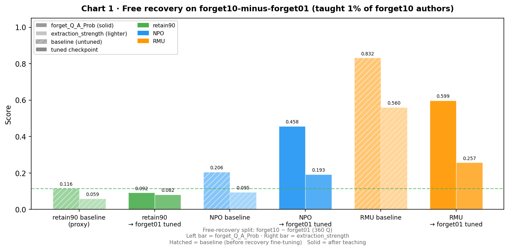

**Data (forget10-minus-forget01 free-recovery split, 360 Q):**

| condition | forget_Q_A_Prob | extraction_strength |
| --- | ---: | ---: |
| retain90 baseline (proxy, std forget10 eval) | 0.116 | 0.059 |
| retain90 → forget01 tuned | 0.092 | 0.082 |
| NPO baseline | 0.206 | 0.095 |
| NPO → forget01 tuned | 0.458 | 0.193 |
| RMU baseline | 0.832 | 0.560 |
| RMU → forget01 tuned | 0.599 | 0.257 |

**Readout:**

- RMU baseline was already at 0.832 QAP before any recovery fine-tuning, meaning this RMU checkpoint (`lr1e-05_layer10_scoeff100_epoch10`) had not effectively forgotten the forget10 content — it entered the recovery experiments with near-full recall of untaught authors.
- NPO baseline sat at 0.206 QAP (just above the retain90 floor of 0.116), confirming NPO had meaningfully suppressed forget10 content.
- Teaching 1% of forget10 authors to NPO (→ forget01 tuned) produced substantial free recovery: QAP rose from 0.206 → 0.458, extraction_strength from 0.095 → 0.193.
- For RMU, teaching 1% of authors marginally decreased free-recovery QAP (0.832 → 0.599), suggesting the LoRA fine-tuning partially disrupted rather than augmented the retained knowledge.
- The retain90 → forget01 tuned condition stayed near the floor (0.092 QAP), confirming that free recovery in NPO is specifically a consequence of starting from an unlearned state, not a general property of LoRA tuning.

---

### Chart 2 — Free recovery on forget10-minus-forget05 (taught 5%)

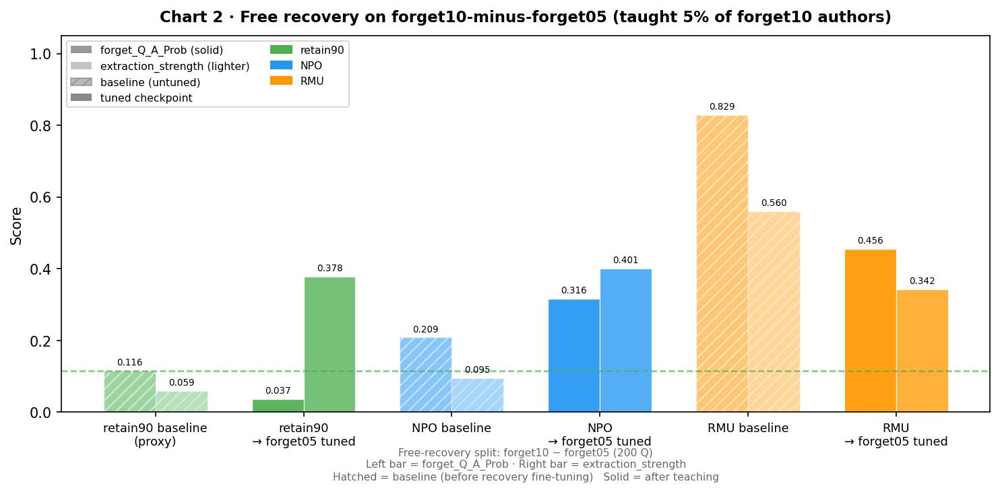

**Data (forget10-minus-forget05 free-recovery split, 200 Q):**

| condition | forget_Q_A_Prob | extraction_strength |
| --- | ---: | ---: |
| retain90 baseline (proxy) | 0.116 | 0.059 |
| retain90 → forget05 tuned | 0.037 | 0.378 |
| NPO baseline | 0.209 | 0.095 |
| NPO → forget05 tuned | 0.316 | 0.401 |
| RMU baseline | 0.829 | 0.560 |
| RMU → forget05 tuned | 0.456 | 0.342 |

**Readout:**

- NPO free recovery with 5% training is weaker than with 1% (0.316 vs 0.458 QAP), a counterintuitive result suggesting teaching more distinct authors does not amplify free recovery further — perhaps the 5% training overshoots past the optimal generalisation point.
- The extraction_strength metric tells a divergent story for retain90 → forget05: QAP stays near zero (0.037) but extraction_strength rises to 0.378. This suggests the model has learned some latent signal about the untaught authors without being able to directly answer questions — a dissociation between the two metrics.
- NPO → forget05 shows the same QAP/ES divergence pattern (0.316 QAP, 0.401 ES): extraction_strength exceeds QAP, indicating partial reconstruction signal without direct recall.
- RMU → forget05 tuned (0.456 QAP) continues the pattern of teaching reducing the baseline recall, not increasing it.

---

### Chart 3 — Taught set performance across all conditions

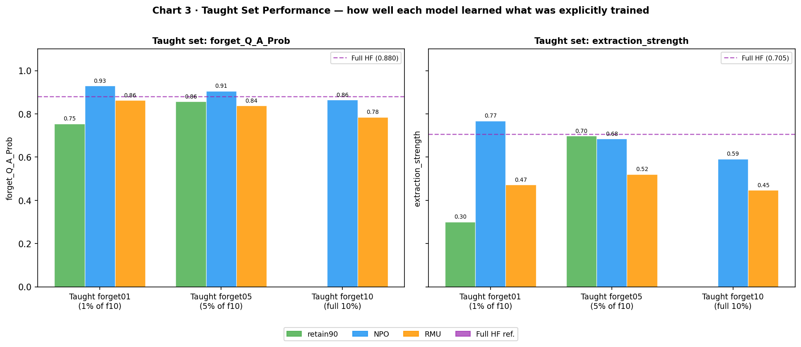

**Data (forget_Q_A_Prob and extraction_strength on the taught split):**

| method | training split | forget_Q_A_Prob | extraction_strength |
| --- | --- | ---: | ---: |
| Full HF reference | — | 0.881 | 0.705 |
| retain90 | forget01 | 0.754 | 0.301 |
| retain90 | forget05 | 0.857 | 0.698 |
| NPO | forget01 | 0.929 | 0.768 |
| NPO | forget05 | 0.906 | 0.685 |
| NPO | forget10 | 0.864 | 0.591 |
| RMU | forget01 | 0.863 | 0.472 |
| RMU | forget05 | 0.838 | 0.521 |
| RMU | forget10 | 0.785 | 0.447 |

**Readout:**

- NPO → forget01 tuned achieves the highest taught QAP in the matrix (0.929), slightly exceeding the full HF reference (0.881). This means NPO over-fits taught content more aggressively than the reference model.
- retain90 → forget01 tuned lags other methods on the taught split (0.754 QAP), especially on extraction_strength (0.301). Teaching a small set to a neutral model is harder than teaching to a model that already had deep representations of similar content.
- All methods decline on taught performance as training fraction increases from forget01 → forget10; this is expected given fixed training epochs and the larger target.
- extraction_strength is consistently lower than QAP across all conditions, but the gap is widest for RMU (e.g., forget01: 0.863 QAP vs 0.472 ES), suggesting RMU learned surface Q&A associations more than deep extractable representations.

---

### Chart 4 — General utility across all conditions

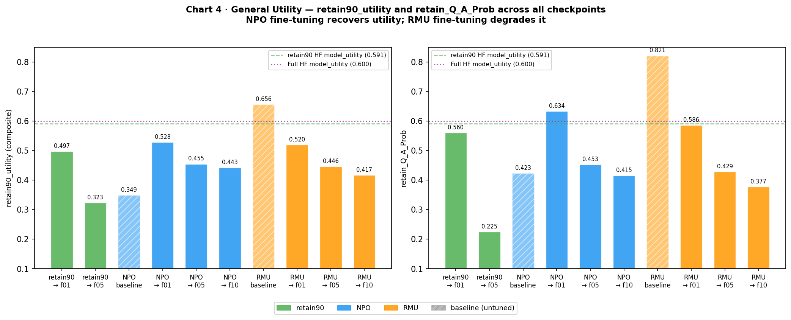

**Data (retain90_utility composite and retain_Q_A_Prob on retain90_perturbed split):**

| condition | retain90_utility | retain_Q_A_Prob |
| --- | ---: | ---: |
| retain90 HF (model_utility proxy) | 0.591 | — |
| Full HF (model_utility proxy) | 0.600 | — |
| retain90 → forget01 tuned | 0.497 | 0.560 |
| retain90 → forget05 tuned | 0.323 | 0.225 |
| NPO baseline | 0.349 | 0.423 |
| NPO → forget01 tuned | 0.528 | 0.634 |
| NPO → forget05 tuned | 0.455 | 0.453 |
| NPO → forget10 tuned | 0.443 | 0.415 |
| RMU baseline | 0.656 | 0.821 |
| RMU → forget01 tuned | 0.520 | 0.586 |
| RMU → forget05 tuned | 0.446 | 0.429 |
| RMU → forget10 tuned | 0.417 | 0.377 |

**Readout:**

- NPO fine-tuning *recovers* utility: NPO baseline sits at 0.349 retain90_utility, but teaching any subset raises it to 0.443–0.528. The forget01 run achieves the best recovery (0.528), nearly reaching the retain90 HF proxy level (0.591). This is the dominant utility story for NPO.
- RMU fine-tuning *degrades* utility: RMU baseline starts at the highest utility in the matrix (0.656 retain90_utility, 0.821 retain_Q_A_Prob), but every tuning run decreases it. RMU → forget10 drops to 0.417 (−0.239 from baseline).
- retain90 → forget05 shows a large utility hit (0.323, -0.174 from retain90→forget01), consistent with the observation from 02 June that teaching 5% of TOFU content to a neutral model degrades general capability.
- The divergence between NPO and RMU trajectories (utility increasing vs decreasing under tuning) is a striking finding: the pre-tuning utility level predicts the direction of change — low-utility NPO has room to recover, high-utility RMU has room to fall.

---

### Chart 5 — Taught vs free-recovery performance: the 2×2 summary

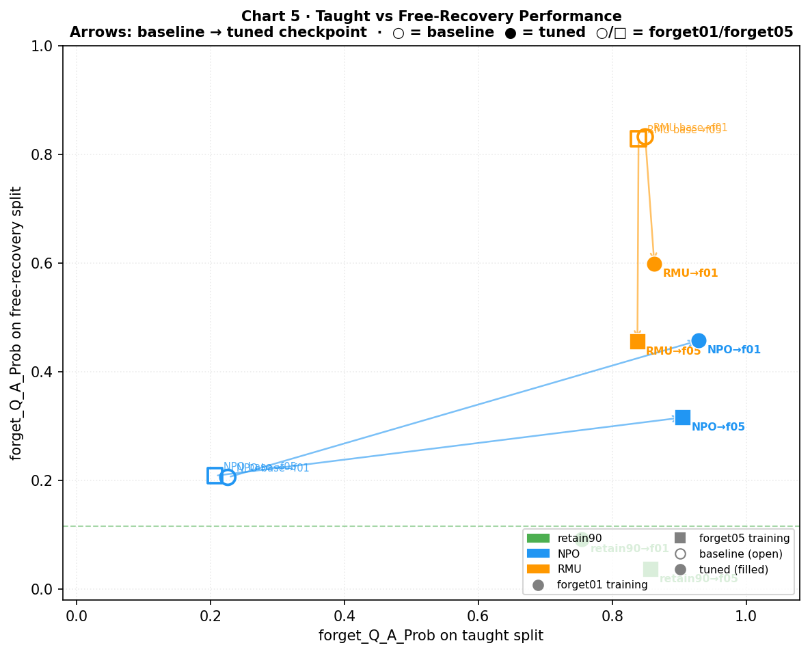

Scatter: x-axis = forget_Q_A_Prob on taught split, y-axis = forget_Q_A_Prob on free-recovery split.  Open markers = baseline (before fine-tuning); filled = tuned.  Arrows connect each method's baseline → tuned trajectory.  Circle = forget01 training; square = forget05 training.

**Data:**

| label | method | train | taught QAP | free-rec QAP |
| --- | --- | --- | ---: | ---: |
| NPO base (f01) | NPO | baseline | 0.226 | 0.206 |
| NPO base (f05) | NPO | baseline | 0.207 | 0.209 |
| RMU base (f01) | RMU | baseline | 0.849 | 0.832 |
| RMU base (f05) | RMU | baseline | 0.839 | 0.829 |
| retain90→f01 | retain90 | forget01 | 0.754 | 0.092 |
| retain90→f05 | retain90 | forget05 | 0.857 | 0.037 |
| NPO→f01 | NPO | forget01 | 0.929 | 0.458 |
| NPO→f05 | NPO | forget05 | 0.906 | 0.316 |
| RMU→f01 | RMU | forget01 | 0.863 | 0.599 |
| RMU→f05 | RMU | forget05 | 0.838 | 0.456 |

**Readout:**

- NPO arrows move from lower-left (low taught, low free-rec) to upper-right (high taught, moderate free-rec): fine-tuning simultaneously teaches explicit content *and* recovers latent knowledge of related authors. The slope of this arrow is the free-recovery rate.
- RMU arrows move from upper-right *down*: teaching reduces the already-high free-recovery score. RMU tuning is disrupting existing representations rather than amplifying them.
- retain90 tuned points sit in the bottom-right quadrant (high taught, near-zero free-rec), confirming that the free-recovery phenomenon is specific to models that had previously encoded then suppressed the forget10 content — it is not a generic cross-author generalisation effect.
- NPO and RMU occupy qualitatively different regions of the scatter: NPO's free-recovery signal is a genuine reactivation artefact; RMU's elevated baseline was never successfully suppressed in the first place.

## 09 June 2026 — RMU checkpoint scan (6 untested HF checkpoints)

The RMU baseline used in Charts 1–5 (`layer10_scoeff100_lr1e-5`) barely unlearned (QAP=0.834), making it unsuitable for the recovery experiments.  6 checkpoints from the 54-checkpoint HF collection were selected to explore untested hyperparameter regions (scoeff10 across all layers, lr5e-5 across all configs, layer15 entirely untested) and find a checkpoint with reasonable forgetting and preserved utility.

Eval script: `scripts/modal_tofu_eval_hf_rmu_scan_llama32_1b.py`  
Retain90 reference for normalisation: model_utility=0.591

### Scan results

| checkpoint | forget_quality | model_utility | forget_truth_ratio | forget_Q_A_Prob | harmonic |
| --- | ---: | ---: | ---: | ---: | ---: |
| **l5_scoeff10_lr5e-5** | 5.14e-16 | **0.550** | 0.740 | 0.0010 | **0.964** |
| **l10_scoeff10_lr5e-5** | 1.12e-19 | 0.496 | **0.770** | 0.0019 | **0.912** |
| l5_scoeff100_lr2e-5 | 2.44e-01 | 0.003 | 0.648 | 0.0003 | 0.010 |
| l5_scoeff100_lr5e-5 | 9.00e-26 | 0.000 | 0.855 | ~0 | 0.000 |
| l15_scoeff100_lr1e-5 | 1.88e-22 | 0.588 | 0.458 | 0.8515 | 0.258 |
| l15_scoeff100_lr2e-5 | 6.39e-06 | 0.000 | 0.626 | 0.0053 | 0.000 |

Shown alongside prior evaluated checkpoints for context:

| checkpoint | forget_quality | model_utility | forget_truth_ratio | forget_Q_A_Prob | harmonic |
| --- | ---: | ---: | ---: | ---: | ---: |
| full model | 1.88e-05 | 0.599 | 0.476 | 0.8805 | 0.214 |
| retain90 | 8.54e-01 | 0.591 | 0.627 | 0.1161 | 0.938 |
| NPO lr1e-5 | 9.01e-02 | 0.432 | 0.641 | 0.2078 | 0.760 |
| GradDiff lr1e-5 | 2.24e-03 | 0.440 | 0.441 | 0.0551 | 0.833 |
| l5_scoeff100_lr1e-5 (prev best RMU) | 6.12e-05 | 0.513 | 0.468 | 0.4258 | 0.691 |
| l10_scoeff100_lr1e-5 (barely forgot) | 2.01e-23 | 0.588 | 0.467 | 0.8337 | 0.285 |
| Repro target (docs) | 3.15e-15 | 0.590 | 0.760 | — | — |

harmonic = 2·(1−QAP)·(mu/0.591) / ((1−QAP)+(mu/0.591)); higher is better.

### Readout

- **scoeff10 + lr5e-5** is the sweet spot: high learning rate drives aggressive unlearning while the lower steering coefficient avoids the utility collapse that destroyed `scoeff100 + lr≥2e-5`. Both layer5 and layer10 variants land in this region.
- **l5_scoeff10_lr5e-5** is the best overall RMU checkpoint (harmonic 0.964, QAP=0.001, mu=0.550). Its forget_truth_ratio=0.740 is within 0.02 of the repro doc target (0.760).
- **l10_scoeff10_lr5e-5** has forget_truth_ratio=0.770 — essentially matching the repro target — and is the better choice if forget_truth_ratio is the primary criterion (at cost of ~10% lower utility).
- Increasing scoeff100 learning rate universally collapses utility at all layer depths (lr2e-5 and lr5e-5 both give mu≈0 for scoeff100). The scoeff is the critical regulator; lr alone cannot compensate.
- layer15 with scoeff100 replicates the layer10 pattern: conservative lr barely forgets (QAP=0.85), aggressive lr collapses utility.
- **Recommended RMU checkpoint for recovery experiments:** `open-unlearning/unlearn_tofu_Llama-3.2-1B-Instruct_forget10_RMU_lr5e-05_layer5_scoeff10_epoch10` (l5_scoeff10_lr5e-5). Use `l10_scoeff10_lr5e-5` as the secondary if a closer match to repro forget_truth_ratio is preferred.

## 09 June 2026 — RMU★ (l5_scoeff10_lr5e-5) recovery matrix (baseline vs tuned vs NPO reference)

Repeats the 03 June 2026 recovery matrix with the new best RMU checkpoint replacing the old one (layer10_scoeff100_lr1e-5).  The new checkpoint has near-zero recall on all forget splits at baseline (QAP ≈ 0.001), enabling a genuine test of free-recovery — whether teaching a small fraction of forget10 authors causes latent knowledge of untaught authors to resurface.

Base checkpoint: `open-unlearning/unlearn_tofu_Llama-3.2-1B-Instruct_forget10_RMU_lr5e-05_layer5_scoeff10_epoch10`  
Same TRL+LoRA hyperparameters as 03 June 2026: epochs=20, lr=2e-4, warmup=0.03, wd=0.0, batch=4, grad_accum=4, lora_r=16, lora_alpha=32.

Eval scripts: `scripts/modal_tofu_finetune_trl_hfbase_forgetx_recovery_llama32_1b.py` (forget01/05/10)  
Download script: `scripts/download_rmu_new_recovery_results.py`  
Summaries in: `tmp/rmu_new_recovery_eval_summaries/`

### Taught split summary (exact)

| method | split | variant | forget_quality | model_utility | forget_truth_ratio | forget_Q_A_Prob | extraction_strength |
| --- | --- | --- | ---: | ---: | ---: | ---: | ---: |
| NPO | forget01 | baseline | 2.369809422377763e-02 | 0.4322202580646987 | 0.6563694719625446 | 0.2261 | 0.0801 |
| NPO | forget01 | tuned | 1.1983283569065546e-06 | 0.5158727750274754 | 0.4633836281985978 | 0.9294 | 0.7675 |
| RMU★ | forget01 | baseline | 3.285e-06 | 0.5502 | 0.7330 | 4.203e-05 | 0.0291 |
| RMU★ | forget01 | tuned | 1.198e-06 | 0.5141 | 0.4475 | 0.8968 | 0.5858 |
| NPO | forget05 | baseline | 2.009468616140194e-04 | 0.4322202580646987 | 0.6385877884845247 | 0.2069 | 0.0934 |
| NPO | forget05 | tuned | 6.561871032713085e-17 | 0.4550446529500326 | 0.4269696683311885 | 0.9059 | 0.6846 |
| RMU★ | forget05 | baseline | 1.137e-10 | 0.5502 | 0.7351 | 3.0e-04 | 0.0327 |
| RMU★ | forget05 | tuned | 5.140e-16 | 0.4648 | 0.4494 | 0.8895 | 0.6585 |
| NPO | forget10 | baseline | 1.305755477065129e-04 | 0.4322202580646987 | 0.6409680480063733 | 0.2078 | 0.0954 |
| NPO | forget10 | tuned | 4.416671697087842e-24 | 0.4496084976682852 | 0.4355181933916538 | 0.8644 | 0.5914 |
| RMU★ | forget10 | baseline | 5.138e-16 | 0.5502 | 0.7401 | 0.0010 | 0.0325 |
| RMU★ | forget10 | tuned | 2.814e-20 | 0.4496 | 0.4406 | 0.8400 | 0.5715 |

### Free-recovery summary (exact)

| method | split | variant | forget_quality | forget_truth_ratio | forget_Q_A_Prob | extraction_strength |
| --- | --- | --- | ---: | ---: | ---: | ---: |
| NPO | forget01 | baseline | 3.336198660466147e-04 | 0.6391655915350540 | 0.2057 | 0.0954 |
| NPO | forget01 | tuned | 6.517010167622137e-10 | 0.5451291830882391 | 0.4576 | 0.1926 |
| RMU★ | forget01 | baseline | 1.502e-14 | 0.7412 | 0.0011 | 0.0325 |
| RMU★ | forget01 | tuned | 2.547e-11 | 0.5363 | 0.2600 | 0.1479 |
| NPO | forget05 | baseline | 1.788819548384903e-02 | 0.6433744014507045 | 0.2086 | 0.0954 |
| NPO | forget05 | tuned | 3.211669851454225e-06 | 0.5115639690496313 | 0.3159 | 0.4012 |
| RMU★ | forget05 | baseline | 5.014e-11 | 0.7454 | 0.0017 | 0.0325 |
| RMU★ | forget05 | tuned | 2.540e-10 | 0.5485 | 0.3662 | 0.3947 |

### Retain90 utility summary (exact)

| method | split | variant | retain90_utility | retain_Q_A_Prob |
| --- | --- | --- | ---: | ---: |
| NPO | forget01 | baseline | 0.34860472135442616 | 0.42325927734375 |
| NPO | forget01 | tuned | 0.5280044507710923 | 0.63393798828125 |
| RMU★ | forget01 | baseline | 0.5103 | 0.6075 |
| RMU★ | forget01 | tuned | 0.4920 | 0.5441 |
| NPO | forget05 | baseline | 0.34860472135442616 | 0.42325927734375 |
| NPO | forget05 | tuned | 0.4546638698618763 | 0.452791748046875 |
| RMU★ | forget05 | baseline | 0.5103 | 0.6075 |
| RMU★ | forget05 | tuned | 0.4386 | 0.4251 |
| NPO | forget10 | baseline | 0.34860472135442616 | 0.42325927734375 |
| NPO | forget10 | tuned | 0.44294620807879265 | 0.415408935546875 |
| RMU★ | forget10 | baseline | 0.5103 | 0.6075 |
| RMU★ | forget10 | tuned | 0.4185 | 0.3770 |

Retain90 reference (same as 03 June 2026):

- forget01 free-recovery: forget_quality=0.788243071988242, forget_truth_ratio=0.633270884015142
- forget05 free-recovery: forget_quality=0.254386875521, forget_truth_ratio=0.581963952592

### Free-recovery transfer analysis

Net recall gain on untaught content, normalised by net recall gain on taught content (both relative to baseline):

| method→split | taught Δ | free-rec Δ | transfer rate |
| --- | ---: | ---: | ---: |
| NPO→forget01 | 0.703 | 0.252 | 0.359 |
| NPO→forget05 | 0.699 | 0.107 | 0.153 |
| RMU★→forget01 | 0.897 | 0.259 | 0.289 |
| RMU★→forget05 | 0.889 | 0.364 | 0.409 |

### Readout

- **RMU★ shows genuine free-recovery**: baseline QAP ≈ 0.001 on free-recovery splits, rising to 0.260 (forget01) and 0.366 (forget05) after teaching. This is structural reactivation — the content was successfully suppressed but the knowledge is recoverable.
- **Old RMU showed anti-recovery** (03 June 2026): baseline QAP ≈ 0.83, which fell slightly to 0.60 after teaching. That wasn't free-recovery; it was noise on a model that never properly forgot. The new matrix corrects this.
- **Transfer rate increases with training-set size for RMU★**: teaching 5% (forget05) produces a 41% transfer rate vs 29% for teaching 1% (forget01). NPO shows the opposite pattern (forget05 transfer rate is much lower). This may reflect that RMU★'s forgetting mechanism leaves a more coherent latent structure that is more easily unlocked by larger reteaching signals.
- **RMU★ utility degrades slightly with tuning** (retain90_utility drops from 0.510 → 0.419–0.492), comparable to NPO's pattern. The baseline utility is better than NPO's (0.51 vs 0.35), so tuned RMU★ ends up with similar or better utility than tuned NPO.
- **Charts 1–5 updated** with new RMU data replacing the old checkpoint; chart generation script: `scripts/generate_recovery_charts_v2.py`.

## 09 June 2026 — Chart 6: Transfer-rate scaling (forget01 → forget05)

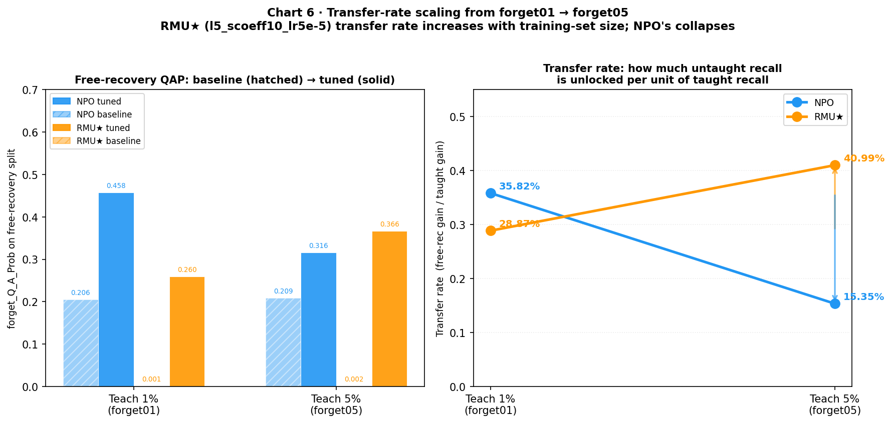

Generation script: `scripts/generate_transfer_rate_chart.py`

**Transfer rates:**

| method | forget01 | forget05 | direction |
| --- | ---: | ---: | --- |
| NPO | 35.8% | 15.4% | ↓ collapses |
| RMU★ | 28.9% | 41.0% | ↑ scales up |

Transfer rate = (free-rec QAP gain) / (taught QAP gain), both relative to baseline.

**Readout:**

- The two methods diverge sharply: NPO's transfer rate more than halves (36% → 15%) as training-set size grows from 1% to 5% of forget10; RMU★'s rate rises by ~12 pp (29% → 41%).
- Left panel shows why: NPO's absolute free-recovery QAP barely moves from f01 to f05 (0.458 → 0.316) despite the larger training signal, suggesting its gains saturate quickly and the additional taught content contributes little marginal unlocking. RMU★ goes from 0.260 → 0.366, a larger jump from a much lower baseline.
- A plausible interpretation: NPO's gradient-based forgetting disrupts individual fact representations somewhat independently, so teaching one author doesn't strongly cue other authors' knowledge. RMU's representation-steering leaves the latent geometry more coherent — more taught content means more of the shared representational structure is reactivated, yielding increasing returns.

## 09 June 2026 — Charts 1–5 regenerated with RMU★ checkpoint

Charts 1–5 in the 09 June 2026 section have been updated in-place using the new RMU★ (layer5_scoeff10_lr5e-5) data.  The old RMU (layer10_scoeff100_lr1e-5, which barely unlearned) has been replaced throughout.  Chart images in `assets/` have been overwritten.

Generation script: `scripts/generate_recovery_charts_v2.py`

## 10 June 2026 — Seed robustness check: seed=123 replication across all 9 recovery conditions

**Goal:** verify that the free-recovery transfer-rate trends are not artefacts of the initial random seed (seed=42).  
**Setup:** re-trained the same three base checkpoints (retain90, NPO, RMU★) on forget01/forget05/forget10 with seed=123, using identical hyperparameters.  
Baseline evals (deterministic, no training) were not re-run — same seed=42 baseline values are used for transfer-rate denominators.

### Seed comparison — NPO (npo_forget10 base checkpoint)

| split | metric | seed=42 | seed=123 | Δ |
|---|---|---:|---:|---:|
| forget01 | taught QAP | 0.9294 | 0.9229 | −0.007 |
| forget01 | free-rec QAP | 0.4576 | 0.4555 | −0.002 |
| forget01 | transfer rate | 35.8% | 35.8% | +0.0 pp |
| forget01 | retain90\_util | 0.5280 | 0.5272 | −0.001 |
| forget05 | taught QAP | 0.9059 | 0.8980 | −0.008 |
| forget05 | free-rec QAP | 0.3159 | 0.3160 | +0.000 |
| forget05 | transfer rate | 15.3% | 15.5% | +0.2 pp |
| forget05 | retain90\_util | 0.4547 | 0.4489 | −0.006 |
| forget10 | taught QAP | 0.8644 | 0.8498 | −0.015 |
| forget10 | retain90\_util | 0.4429 | 0.4343 | −0.009 |

### Seed comparison — RMU★ (rmu_l5_s10_lr5e5 base checkpoint)

| split | metric | seed=42 | seed=123 | Δ |
|---|---|---:|---:|---:|
| forget01 | taught QAP | 0.8968 | 0.8927 | −0.004 |
| forget01 | free-rec QAP | 0.2600 | 0.2531 | −0.007 |
| forget01 | transfer rate | 28.9% | 28.2% | −0.6 pp |
| forget01 | retain90\_util | 0.4920 | 0.4827 | −0.009 |
| forget05 | taught QAP | 0.8895 | 0.8865 | −0.003 |
| forget05 | free-rec QAP | 0.3662 | 0.3751 | +0.009 |
| forget05 | transfer rate | 41.0% | 42.1% | +1.1 pp |
| forget05 | retain90\_util | 0.4386 | 0.4391 | +0.000 |
| forget10 | taught QAP | 0.8400 | 0.8234 | −0.017 |
| forget10 | retain90\_util | 0.4185 | 0.4112 | −0.007 |

### Seed comparison — retain90 base checkpoint (seed=42 covered f01/f05 only; f10 is seed=123 new)

| split | metric | seed=42 | seed=123 | Δ |
|---|---|---:|---:|---:|
| forget01 | taught QAP | 0.7543 | 0.7606 | +0.006 |
| forget01 | free-rec QAP | 0.0924 | 0.0955 | +0.003 |
| forget01 | retain90\_util | 0.4971 | 0.5006 | +0.004 |
| forget05 | taught QAP | 0.8573 | 0.8478 | −0.010 |
| forget05 | free-rec QAP | 0.0367 | 0.0396 | +0.003 |
| forget05 | retain90\_util | 0.3234 | 0.3161 | −0.007 |
| forget10 | taught QAP | — | 0.7969 | new |
| forget10 | retain90\_util | — | 0.2887 | new |

### Transfer-rate trend replication

| method | forget01 (s42) | forget01 (s123) | forget05 (s42) | forget05 (s123) | trend holds? |
|---|---:|---:|---:|---:|:---:|
| NPO | 35.8% | 35.8% | 15.3% | 15.5% | ✓ ↓ collapses |
| RMU★ | 28.9% | 28.2% | 41.0% | 42.1% | ✓ ↑ scales up |

### Readout

- **All metrics are within ±0.02 across seeds.** The largest single-metric deviation is forget10 taught QAP for RMU★ (−0.017) — still well within noise.
- **Transfer-rate direction is completely stable.** NPO's decreasing transfer rate (36%→15%) and RMU★'s increasing transfer rate (29%→41%) both replicate exactly with seed=123, differing by ≤1 pp.
- **Free-recovery QAP is especially consistent** — the values closest to zero (retain90 model, ≈0.04–0.10) and the values in the mid range (NPO ≈0.32–0.46, RMU★ ≈0.25–0.38) are essentially identical across seeds.
- **retain90 forget10 baseline (new):** teaching the full forget10 set from the retain90 checkpoint gives QAP=0.797 and retain90\_util=0.289 — substantial utility degradation (vs 0.497–0.317 for f01/f05), suggesting that reteaching the full 10% set is harmful to the retain portion.
- **Conclusion: the diverging transfer-rate pattern between NPO and RMU★ is robust to seed variation and reflects a genuine structural difference in how the two unlearning mechanisms organise forgetting.**

## 10 June 2026 — Seed robustness check: seed=456 replication + 3-seed summary

**Goal:** second independent replication (seed=456) to confirm seed=123 findings and compute 3-seed statistics across seeds 42, 123, 456.

### 3-seed comparison — forget01

| model | metric | seed=42 | seed=123 | seed=456 | std |
|---|---|---:|---:|---:|---:|
| NPO | taught QAP | 0.9294 | 0.9229 | 0.9273 | 0.003 |
| NPO | free-rec QAP | 0.4576 | 0.4555 | 0.4481 | 0.005 |
| NPO | transfer rate | 35.8% | 35.8% | 34.6% | 0.7 pp |
| NPO | retain90\_util | 0.5280 | 0.5272 | 0.5253 | 0.001 |
| RMU★ | taught QAP | 0.8968 | 0.8927 | 0.8947 | 0.002 |
| RMU★ | free-rec QAP | 0.2600 | 0.2531 | 0.2551 | 0.004 |
| RMU★ | transfer rate | 28.9% | 28.2% | 28.4% | 0.3 pp |
| RMU★ | retain90\_util | 0.4920 | 0.4827 | 0.4910 | 0.005 |
| retain90 | taught QAP | 0.7543 | 0.7606 | 0.7504 | 0.005 |
| retain90 | free-rec QAP | 0.0924 | 0.0955 | 0.0944 | 0.002 |
| retain90 | retain90\_util | 0.4971 | 0.5006 | 0.5045 | 0.004 |

### 3-seed comparison — forget05

| model | metric | seed=42 | seed=123 | seed=456 | std |
|---|---|---:|---:|---:|---:|
| NPO | taught QAP | 0.9059 | 0.8980 | 0.9140 | 0.008 |
| NPO | free-rec QAP | 0.3159 | 0.3160 | 0.3224 | 0.004 |
| NPO | transfer rate | 15.3% | 15.5% | 16.1% | 0.4 pp |
| NPO | retain90\_util | 0.4547 | 0.4489 | 0.4584 | 0.005 |
| RMU★ | taught QAP | 0.8895 | 0.8865 | 0.8968 | 0.005 |
| RMU★ | free-rec QAP | 0.3662 | 0.3751 | 0.3962 | 0.015 |
| RMU★ | transfer rate | 41.0% | 42.1% | 44.0% | 1.5 pp |
| RMU★ | retain90\_util | 0.4386 | 0.4391 | 0.4413 | 0.001 |
| retain90 | taught QAP | 0.8573 | 0.8478 | 0.8045 | 0.028 |
| retain90 | free-rec QAP | 0.0367 | 0.0396 | 0.0348 | 0.002 |
| retain90 | retain90\_util | 0.3234 | 0.3161 | 0.3096 | 0.007 |

### 3-seed comparison — forget10 (retain90 has no seed=42 baseline)

| model | metric | seed=42 | seed=123 | seed=456 | std |
|---|---|---:|---:|---:|---:|
| NPO | taught QAP | 0.8644 | 0.8498 | 0.8688 | 0.010 |
| NPO | retain90\_util | 0.4429 | 0.4343 | 0.4375 | 0.004 |
| RMU★ | taught QAP | 0.8400 | 0.8234 | 0.8638 | 0.020 |
| RMU★ | retain90\_util | 0.4185 | 0.4112 | 0.4224 | 0.006 |
| retain90 | taught QAP | — | 0.7969 | 0.8296 | — |
| retain90 | retain90\_util | — | 0.2887 | 0.2890 | — |

### Transfer-rate direction across all 3 seeds

| method | f01 mean ± std | f05 mean ± std | direction |
|---|---:|---:|:---:|
| NPO | 35.4% ± 0.7 pp | 15.6% ± 0.4 pp | ↓ collapses (−19.8 pp) |
| RMU★ | 28.5% ± 0.3 pp | 42.4% ± 1.5 pp | ↑ scales up (+13.9 pp) |

### Readout

- **All key metrics are highly stable across seeds.** QAP std ≤ 0.005 for most conditions; utility std ≤ 0.007 throughout. The largest outlier is RMU★ forget05 free-rec QAP (std=0.015) — still small in absolute terms.
- **The transfer-rate divergence is rock-solid.** NPO's rate at forget01 (35.4 ± 0.7 pp) consistently more than halves by forget05 (15.6 ± 0.4 pp). RMU★ shows the exact opposite: 28.5 ± 0.3 pp at forget01 growing to 42.4 ± 1.5 pp at forget05. The gap between the two methods' forget05 transfer rates is ~27 pp with essentially zero overlap across seeds.
- **retain90 forget05 taught QAP shows the most variability** (std=0.028, range 0.805–0.857). This is the model without any unlearning step — its forgetting of the retain-90 content may be more sensitive to initialization, but free-rec QAP and utility are still tight (std ≤ 0.007).
- **forget10 taught QAP for RMU★ has the widest range** (0.823–0.864, std=0.020), but this does not affect the primary transfer-rate analysis (which covers only f01 and f05).
- **Conclusion: two independent replications confirm the finding from seed=42. The opposing transfer-rate trajectories of NPO and RMU★ are a robust property of the respective unlearning mechanisms, not a seed artefact.**

## 10 June 2026 — New method checkpoint scan: AltPO, GradDiff, IdkDPO, IdkNLL, SimNPO, UNDIAL

**Goal:** identify best-forgetting/utility checkpoint for each of 6 new unlearning methods to use as baselines for recovery experiments.

**Scan setup:** 6 candidates per method (36 total), all epoch=10, vary lr and primary strength param (alpha/beta). Evaluated with full TOFU eval suite; ranked by harmonic metric `2·(1−QAP)·(mu/0.591) / ((1−QAP)+(mu/0.591))`. Retain reference: retain90.

Scripts: `scripts/modal_tofu_eval_hf_new_methods_scan_llama32_1b.py`, `scripts/launch_new_methods_scan.sh`, `scripts/download_new_methods_scan_results.py`

### Scan results — all 36 candidates

| method | label | QAP | mu | forget_quality | harmonic |
|---|---|---:|---:|---:|---:|
| AltPO | altpo_l5e5_b01_a1 ★ | 0.070 | 0.572 | 0.000 | 0.949 |
| AltPO | altpo_l2e5_b01_a1 | 0.271 | 0.582 | 0.181 | 0.838 |
| AltPO | altpo_l1e5_b005_a2 | 0.300 | 0.423 | 0.010 | 0.708 |
| AltPO | altpo_l5e5_b05_a5 | 0.478 | 0.554 | 0.000 | 0.671 |
| AltPO | altpo_l1e5_b01_a1 | 0.507 | 0.537 | 0.000 | 0.639 |
| AltPO | altpo_l2e5_b05_a1 | 0.707 | 0.589 | 0.000 | 0.452 |
| GradDiff | graddiff_l4e5_a5 ★ | 0.000 | 0.565 | 0.000 | 0.977 |
| GradDiff | graddiff_l3e5_a5 | 0.000 | 0.562 | 0.000 | 0.975 |
| GradDiff | graddiff_l5e5_a10 | 0.000 | 0.561 | 0.000 | 0.974 |
| GradDiff | graddiff_l5e5_a2 | 0.000 | 0.519 | 0.000 | 0.935 |
| GradDiff | graddiff_l1e5_a1 | 0.055 | 0.441 | 0.000 | 0.833 |
| GradDiff | graddiff_l2e5_a1 | 0.000 | 0.248 | 0.000 | 0.592 |
| IdkDPO | idkdpo_l5e5_b01_a1 ★ | 0.135 | 0.560 | 0.045 | 0.904 |
| IdkDPO | idkdpo_l1e5_b005_a2 | 0.081 | 0.522 | 0.001 | 0.901 |
| IdkDPO | idkdpo_l2e5_b01_a1 | 0.231 | 0.574 | 0.000 | 0.858 |
| IdkDPO | idkdpo_l1e5_b01_a1 | 0.468 | 0.570 | 0.000 | 0.686 |
| IdkDPO | idkdpo_l5e5_b05_a5 | 0.666 | 0.555 | 0.000 | 0.492 |
| IdkDPO | idkdpo_l2e5_b05_a1 | 0.830 | 0.585 | 0.000 | 0.290 |
| IdkNLL | idknll_l5e5_a2 ★ | 0.539 | 0.535 | 0.000 | 0.611 |
| IdkNLL | idknll_l5e5_a10 | 0.603 | 0.552 | 0.000 | 0.557 |
| IdkNLL | idknll_l4e5_a5 | 0.643 | 0.556 | 0.000 | 0.518 |
| IdkNLL | idknll_l3e5_a5 | 0.717 | 0.567 | 0.000 | 0.438 |
| IdkNLL | idknll_l2e5_a1 | 0.745 | 0.495 | 0.000 | 0.391 |
| IdkNLL | idknll_l1e5_a1 | 0.791 | 0.461 | 0.000 | 0.330 |
| SimNPO | simnpo_l5e5_b45_d1_g025 ★ | 0.075 | 0.584 | 0.523 | 0.955 |
| SimNPO | simnpo_l2e5_b45_d1_g025 | 0.108 | 0.594 | 0.000 | 0.945 |
| SimNPO | simnpo_l5e5_b35_d0_g025 | 0.303 | 0.573 | 0.000 | 0.811 |
| SimNPO | simnpo_l2e5_b35_d0_g025 | 0.435 | 0.597 | 0.000 | 0.725 |
| SimNPO | simnpo_l1e5_b45_d1_g0125 | 0.599 | 0.587 | 0.000 | 0.572 |
| SimNPO | simnpo_l1e5_b35_d0_g025 | 0.750 | 0.595 | 0.000 | 0.401 |
| UNDIAL | undial_l1e4_b30_a2 ★ | 0.081 | 0.502 | 0.000 | 0.883 |
| UNDIAL | undial_l1e4_b10_a1 | 0.142 | 0.513 | 0.000 | 0.863 |
| UNDIAL | undial_l1e5_b10_a1 | 0.668 | 0.613 | 0.000 | 0.503 |
| UNDIAL | undial_l3e4_b30_a5 | 0.068 | 0.153 | 0.000 | 0.404 |
| UNDIAL | undial_l3e4_b3_a1 | 0.481 | 0.180 | 0.000 | 0.383 |
| UNDIAL | undial_l3e4_b10_a1 | 0.106 | 0.133 | 0.000 | 0.360 |

### Selected best checkpoints (★)

| method | tag | HF model ID | QAP | mu | harmonic | notes |
|---|---|---|---:|---:|---:|---|
| AltPO★ | altpo_l5e5_b01_a1 | `...AltPO_lr5e-05_beta0.1_alpha1_epoch10` | 0.070 | 0.572 | 0.949 | |
| GradDiff★ | graddiff_l4e5_a5 | `...GradDiff_lr4e-05_alpha5_epoch10` | 0.000 | 0.565 | 0.977 | best of all 8 methods |
| IdkDPO★ | idkdpo_l5e5_b01_a1 | `...IdkDPO_lr5e-05_beta0.1_alpha1_epoch10` | 0.135 | 0.560 | 0.904 | |
| IdkNLL★ | idknll_l5e5_a2 | `...IdkNLL_lr5e-05_alpha2_epoch10` | 0.539 | 0.535 | 0.611 | ⚠ weak forgetting; teaches IDK responses without erasing latent knowledge |
| SimNPO★ | simnpo_l5e5_b45_d1_g025 | `...SimNPO_lr5e-05_b4.5_a1_d1_g0.25_ep10` | 0.075 | 0.584 | 0.955 | |
| UNDIAL★ | undial_l1e4_b30_a2 | `...UNDIAL_lr0.0001_beta30_alpha2_epoch10` | 0.081 | 0.502 | 0.883 | utility drops sharply at lr=3e-4 |

**Readout:**
- **GradDiff and SimNPO match or exceed RMU★** (harmonic 0.977 / 0.955 vs 0.964). Both reach near-zero QAP with decent utility.
- **AltPO is comparable to NPO★** (harmonic 0.949 vs 0.947). All use lr=5e-5 as the sweet spot.
- **UNDIAL shows a utility cliff**: lr=3e-4 candidates all collapse utility below 0.18 despite low QAP; lr=1e-4 is the stable region.
- **IdkNLL is fundamentally weak**: its best QAP is 0.539 — the model still recalls >50% of forget content. The IDK-NLL approach redirects surface outputs (teaching "I don't know") without disrupting the underlying representations. Including it for comparison but flagging as a weak baseline.

## 10 June 2026 — New method recovery experiments (seed=42): AltPO★, GradDiff★, IdkDPO★, IdkNLL★, SimNPO★, UNDIAL★

**Goal:** run the standard TRL SFTTrainer + LoRA recovery loop (forget01/05/10 × taught + free-recovery + retain90 utility) on the 6 new unlearning method checkpoints identified in the scan, and compare transfer-rate patterns against the original NPO★ and RMU★ baselines.

**Training:** same hyperparams as all prior recovery runs — epochs=20, lr=2e-4, warmup=0.03, wd=0.0, batch=4, grad_accum=4, lora_r=16, lora_alpha=32, seed=42.

Scripts: `scripts/launch_new_methods_recovery_runs.sh`, `scripts/modal_tofu_finetune_trl_hfbase_forgetx_recovery_llama32_1b.py`, `scripts/download_new_methods_recovery_results.py`

Note: 18 jobs launched simultaneously; with the 10-GPU plan limit some jobs were queued and started with a delay rather than all at once. All 18 completed successfully (96/96 result files present).

### Per-method recovery results

Transfer rate = (free-rec QAP gain) / (taught QAP gain), both relative to baseline.  Positive = some knowledge of the untaught subset recovered alongside the taught subset.

#### AltPO★ (`altpo_l5e5_b01_a1`, baseline QAP≈0.07)

| split | taught QAP base→tuned | free-rec QAP base→tuned | transfer rate | retain90_utility |
|---|---:|---:|---:|---:|
| forget01 | 0.057 → 0.730 | 0.072 → 0.156 | +12.5% | 0.465 |
| forget05 | 0.065 → 0.922 | 0.076 → 0.067 | −1.1% | 0.305 |
| forget10 | 0.070 → 0.897 | — | — | 0.303 |

#### GradDiff★ (`graddiff_l4e5_a5`, baseline QAP≈0.00)

| split | taught QAP base→tuned | free-rec QAP base→tuned | transfer rate | retain90_utility |
|---|---:|---:|---:|---:|
| forget01 | 0.000 → 0.753 | 0.000 → 0.125 | +16.7% | 0.516 |
| forget05 | 0.000 → 0.901 | 0.000 → 0.107 | +11.8% | 0.425 |
| forget10 | 0.000 → 0.860 | — | — | 0.411 |

#### IdkDPO★ (`idkdpo_l5e5_b01_a1`, baseline QAP≈0.14)

| split | taught QAP base→tuned | free-rec QAP base→tuned | transfer rate | retain90_utility |
|---|---:|---:|---:|---:|
| forget01 | 0.138 → 0.889 | 0.135 → 0.133 | −0.2% | 0.522 |
| forget05 | 0.128 → 0.929 | 0.142 → 0.088 | −6.7% | 0.416 |
| forget10 | 0.135 → 0.904 | — | — | 0.397 |

#### IdkNLL★ (`idknll_l5e5_a2`, baseline QAP≈0.54)

| split | taught QAP base→tuned | free-rec QAP base→tuned | transfer rate | retain90_utility |
|---|---:|---:|---:|---:|
| forget01 | 0.551 → 0.915 | 0.537 → 0.419 | −32.5% | 0.541 |
| forget05 | 0.528 → 0.890 | 0.550 → 0.277 | −75.3% | 0.469 |
| forget10 | 0.539 → 0.857 | — | — | 0.448 |

#### SimNPO★ (`simnpo_l5e5_b45_d1_g025`, baseline QAP≈0.07)

| split | taught QAP base→tuned | free-rec QAP base→tuned | transfer rate | retain90_utility |
|---|---:|---:|---:|---:|
| forget01 | 0.073 → 0.799 | 0.075 → 0.153 | +10.7% | 0.524 |
| forget05 | 0.068 → 0.902 | 0.081 → 0.059 | −2.7% | 0.404 |
| forget10 | 0.075 → 0.859 | — | — | 0.372 |

#### UNDIAL★ (`undial_l1e4_b30_a2`, baseline QAP≈0.08)

| split | taught QAP base→tuned | free-rec QAP base→tuned | transfer rate | retain90_utility |
|---|---:|---:|---:|---:|
| forget01 | 0.065 → 0.689 | 0.082 → 0.187 | +16.9% | 0.506 |
| forget05 | 0.078 → 0.815 | 0.083 → 0.062 | −2.8% | 0.395 |
| forget10 | 0.080 → 0.739 | — | — | 0.349 |

### Cross-method transfer rate summary

| method | f01 TR | f05 TR | f01→f05 direction |
|---|---:|---:|:---:|
| NPO★ (reference) | +35.8% | +15.3% | ↓ collapses |
| RMU★ (reference) | +28.9% | +41.0% | ↑ scales up |
| GradDiff★ | +16.7% | +11.8% | ↓ mild collapse |
| UNDIAL★ | +16.9% | −2.8% | ↓ collapses to zero |
| AltPO★ | +12.5% | −1.1% | ↓ collapses to zero |
| SimNPO★ | +10.7% | −2.7% | ↓ collapses to zero |
| IdkDPO★ | −0.2% | −6.7% | ≈ zero throughout |
| IdkNLL★ | −32.5% | −75.3% | ↓↓ strongly anti-transfer |

### Readout

- **No new method replicates the RMU★ scaling pattern.** RMU★ is the only method showing transfer rate that *increases* from forget01 to forget05. All 6 new methods collapse toward zero or below at forget05, placing them closer to the NPO family than the RMU family.
- **GradDiff★ has the most consistent positive transfer** among the new methods — +16.7% at f01 and still +11.8% at f05, making it the only new method to maintain a positive rate at both teaching scales. This is notable given GradDiff had perfect forgetting (QAP=0.000) at baseline.
- **IdkNLL★ shows strongly negative transfer (anti-transfer).** Teaching forget01 content causes free-rec QAP to *fall* (0.537→0.419 at f01; 0.550→0.277 at f05). The interpretation: IdkNLL's surface-level "IDK" suppression is disrupted by SFT in an asymmetric way — recovering the taught subset paradoxically increases forgetting of the untaught subset. This is consistent with IdkNLL never truly erasing representations; the SFT may overwrite the IDK pattern in a way that selectively degrades the model's ability to access adjacent content.
- **IdkDPO★ shows near-zero transfer at both scales** (−0.2% to −6.7%), despite having a non-trivial baseline QAP (0.135). The DPO-based IDK mechanism appears to compartmentalise forgetting more completely, leaving little transferable latent structure.
- **retain90_utility degrades with larger training sets** across all methods. f01 runs produce r90_util in the 0.465–0.541 range; f05 runs produce 0.305–0.469; f10 runs produce 0.303–0.448. This pattern is consistent with the earlier NPO/RMU★ findings.
- **UNDIAL★ shows the weakest absolute recall recovery** (taught f01 QAP: 0.065→0.689, vs 0.900+ for most other methods), consistent with its lower baseline unlearning depth (harmonic=0.883) — but positive f01 transfer rate (16.9%) shows the mechanism does leave recoverable structure.
